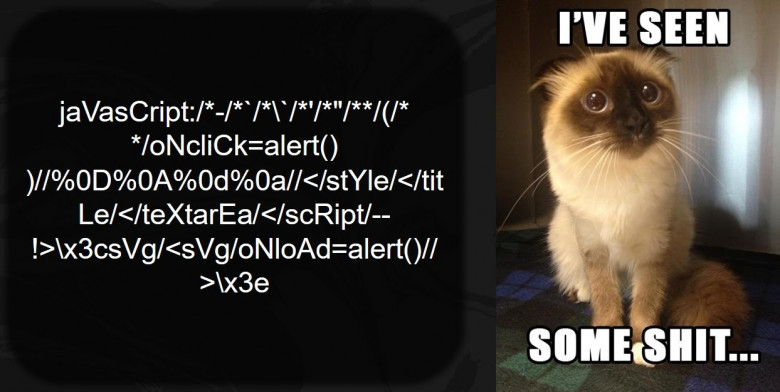
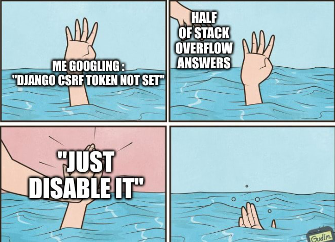
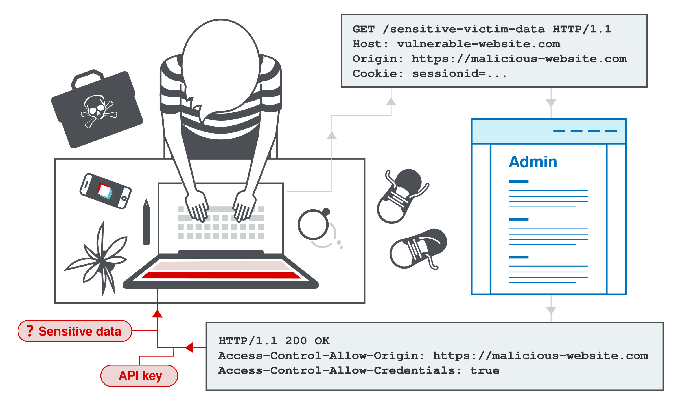

Всем привет, котятки! В одной из прошлых статей [@bebra](https://t.me/S4ar1488) [рассказал](http://localhost:1313/posts/web_start) вам о категории web, какие знания она даёт, а также затронул два типа уязвимостей - client-side и server-side. О первых сегодня и поговорим.

## Да кто такие эти ваши Client-Side

Исходя из названия, можно догадаться, что это уязвимости на стороне клиента, обычного юзера. Мисконфигурации, неправильная логика работы приложения, использование HTTP, а не HTTPS, ошибки бизнес логики, всё это может послужить возникновению уязвимостей.

## &lt;script&gt;alert('hacked')&lt;/script&gt;



Одна из самых часто встречающихся уязвимостей клиентской стороны - XSS (Cross-site Scripting). С её помощью можно украсть такую чувствительную информацию как куки или токены авторизации. Существует три типа XSS:

- Reflected (отраженная) XSS

Это значится палучаеца когда мы передаем наш зловредный скрипт (смотри подзаголовок) в URL. Наивный пользователь переходит по вредоносной ссылке `http://badsite.com/search?query=<script>alert('haha_popalsya')</script>`  и у него выполняется данный скрипт.

- Stored (хранимая) XSS

Тут поинтереснее. Допустим, у нас есть сайт с рецептами, у него есть функциональность комментариев, где ты можешь написать, что сочетание чеснока и шоколада не самое лучшее, ~~пожелать автору рецепта смерти и рассказать ему всё про его семью~~. Но это слишком скучно. Намного веселее проэксплуатировать хранимую xss! Пишешь скрипт, который ворует куки, оставляешь его в качестве комментария, автор заходит на страницу со своим рецептом и твоим комментарием, и у него автоматически исполняется скрипт! Бинго! Ты получаешь его (и всех остальных бедолаг, которых тоже заинтересовал рецепт) куки, заходишь в страничку управления учетной записью и удаляешь его аккаунт. Боже как же это весело :)

- DOM-based XSS

DOM - это документная модель объекта, по сути просто API для html и xml разметки. XSS тут появляется, когда веб-приложение уже содержит какой-то клиентский js. И бывает так, что данные, поступаемые на вход, такой js обрабатывает некорректно и записывает измененения обратно в DOM. Понимаю, что это звучит сложно, но на деле всё проще. Пусть есть такой код на странице:

```
<body>
    <script>
        var l = location.hash.slice (l);
        eval(l);
    </script>
</body>
```

Увидев это, любой уважающий себя мамин хакер, поймёт, что всё, что будет в запросе после # будет исполняться. 

`http://badsite.com/index.html#alert(document.cookie)`

Че с куками пацаны?

### В качестве трени предагаю вам самим развернуть и решить таск на XSS с UgraCTF Quals 2023

Если не получается, то всегда есть райтап

### TLDR

В комментарии блога можно вставить свои тэги. С помощью нашей любимой XSS можно попытаться украсть куки, но заметив, что кроме логина в углу страницы пишется еще и пароль, стоит попробовать угнать сразу пароль.

https://github.com/teamteamdev/ugractf-2023-quals/tree/master/tasks/goodolddays


## Ты сам виноват!



Еще одна уяза, похожая на xss, но работающая немного иначе - CSRF (Cross-site request forgery). Разберем на простом примере. Пусть есть некий форум, на котором можно разместить картинку в комментариях. Хакер Боб разместил сообщение, внедрив такой html тег:

```

```

Когда Алиса тыкнет по картинке, чтобы посмотреть что же там такого интересного, то её куки из банковского приложения автоматически отправятся Бобу. Дальнейших рассуждений думаю можно не проводить, всё и так понятно, Боб получил деньги, а Алиса…


## Действуем по шаблону

Нечасто встречающаяся на кзф, но от этого не менее интересная уяза это CSTI (Client-side template injection). Наверняка вы слышали про SSTI (о ней мы поговорим подробнее в одной из следующих статей по вебу). Разница с CSTI ~~лишь в букве~~ в том, что она позволяет вам выполнять произвольный жава скрипт на сайте-жертве, а не на сервере. Работает это с помощью шаблонизаторов ввода в таких фреймворках, как AngularJS, VueJS и др. Пользовательский ввод обрабатывается в соответствии с правилами шаблонизатора и исполняется. Хакер может добавить туда свой вредоносный жава скрипт и, по аналогии с ИксИксЭс, соврешить кражу кук, токенов, регистрировать нажатия клавиш.


## CORS

CORS - это политика которая обеспечивает контролируемый доступ к ресурсам, расположенным за пределами данного домена.
Неправильно настроенная политика, создает потенциал для междоменных атак. Это хорошо объясняется [тут](https://portswigger.net/web-security/cors). Обязательно изучите сами, решите пару лаб, а я кратко объясню на пальцах. Суть в том, что современные веб приложения постоянно взаимодействуют со сторонними сервисами у которых свои домены. Поэтому некоторые приложения идут по простому пути и просто разрешают доступ из любого другого домена. Приложение читает заголовок `Origin` из HTTP запроса и включает его в свой ответ:

**Request**
```
GET /sensitive-victim-data HTTP/1.1
Host: vulnerable-website.com
Origin: https://malicious-website.com
Cookie: sessionid=...
```

**Response**
```
HTTP/1.1 200 OK
Access-Control-Allow-Origin: https://malicious-website.com
Access-Control-Allow-Credentials: true
...
```

Тут есть как раз `Origin` с вредоносным сайтом и ответ сервера, который подтверждает допустимость источника, и заголовок, разрешающий доступ к учетным данным: `Access-Control-Allow-Credentials: true`. Таким образом, абсолютно любой домен может получить доступ к ресурсам уязвимого домена. Если ответ содержит какую-либо конфиденциальную информацию, такую ​​как ключ API или токен CSRF, вы сможете получить ее.



## CSWS Hijacking

Эта уязвимость появляется при общении через веб-сокеты. В отличие от CSRF, мы получаем двустороннее взаимодействие со скомпрометированным приложением. Благодаря этому, мы можем

1) Совершать несанкционированные действия, маскируясь под пользователя-жертву. 

Как и в случае с обычным CSRF, злоумышленник может отправлять произвольные сообщения серверному приложению. Если приложение использует сгенерированные клиентом сообщения WebSocket для выполнения каких-либо конфиденциальных действий, злоумышленник может генерировать подходящие междоменные сообщения и инициировать эти действия.

2) Получать конфиденциальные данные

Если приложение использует сгенерированные сервером сообщения WebSocket для возврата каких-либо конфиденциальных данных пользователю, злоумышленник может перехватить эти сообщения и перехватить данные пользователя-жертвы.

3) Совершить DOS

Отправляя большое количество недопустимых или искаженных фреймов, мы можем положить сервер

## Что ещё?

Мы рассмотрели самые популярные client-side уязвимости, которые чаще всего встречаются на CTF. Но это далеко не всё. Поэтому обязательно изучайте новые уязвимости сами, гуглите, смотрите разборы CTF, решайте лабы портсвигера и всё будет хорошо


### Полезные материалы

https://habr.com/ru/companies/bastion/articles/757590/ - хорошая статья в качестве дополнения к этой

https://portswigger.net/web-security/all-topics - база. Глубокое объяснение + лабы, в пояснениях не нуждается

https://book.hacktricks.xyz/welcome/readme - сайт с огромным количеством контента по пентесту, в том числе и по вебу. Представляет собой сборник инструкций и готовых пэйлодов для реализации. 

https://app.hackthebox.com - платформа также не нуждается в представлении, в контексте статьи нас интересуют челленджи в категории веб, есть градация по сложности, хинты, форум

