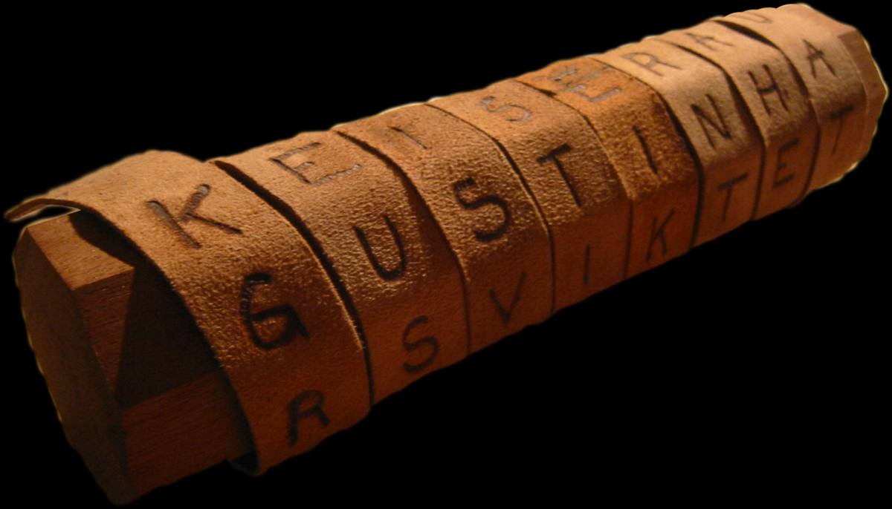
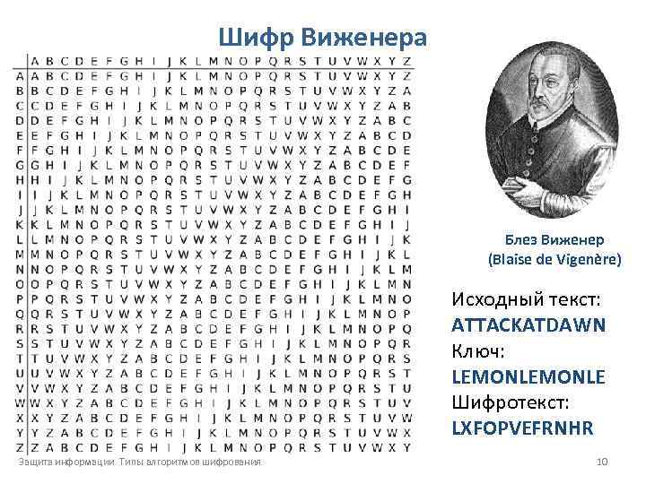
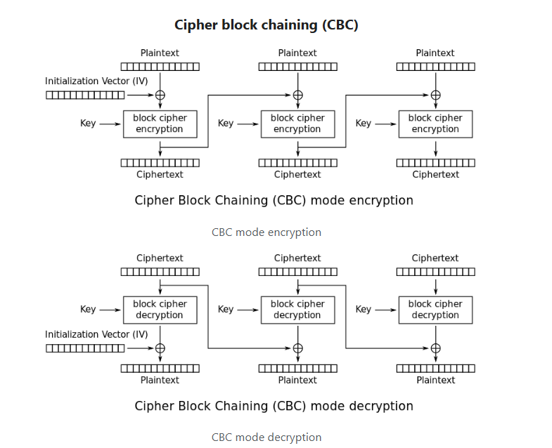
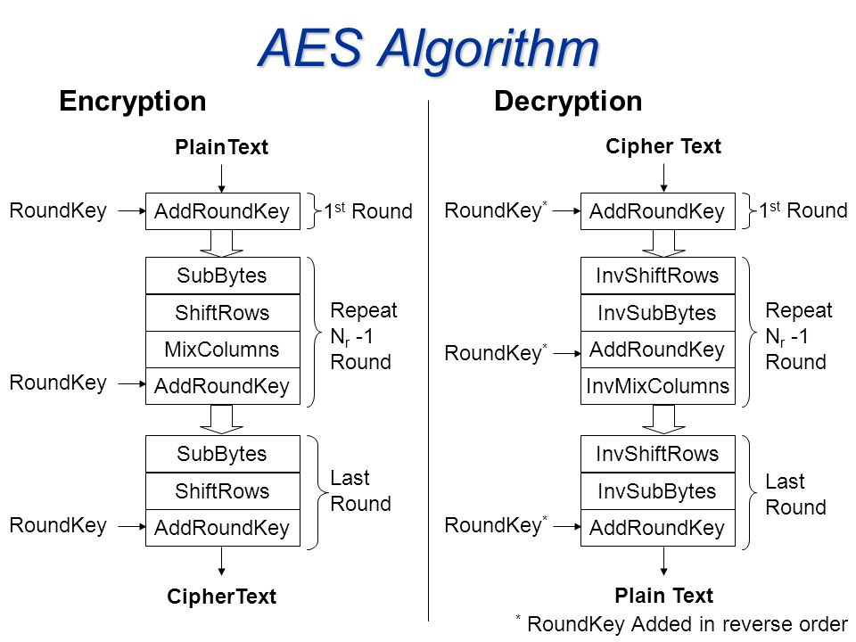
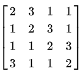
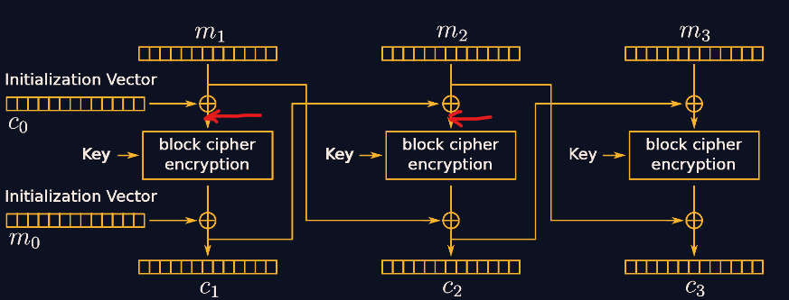

--- 
title: "Зная эти две атаки, можно ... Читать далее"
description: ""
date: 2024-06-13
summary: "Немного базы по криптографии, а именно истоия(кратенько) + разбор двух базовых атак."

series: ["Crypto basics"]
series_order: 2

tags: ["crypto"]
showAuthor: true
authors:
  - "Zer0bp"
---

# Введение
В предыдущей статье я рассказывал про формат сертификатов. В этой статье хочется рассказать про что-то более общее,про историю криптографии(кратенько), а также про конкретные атаки

# История

## Скитала 

Еще в Древней Греции, а именно Спарте, осознали, что приватность некоторых сообщений необходима. Был придуман следующий метод: брали цилиндр(жезл), на него наматывали длинную пергаментную ленту, записывали сообщение, после эту бумагу спокойно передавали. Не зная размеров цилиндра, восстановить исходное сообщение было проблематично.

## Шифр Цезаря - прародитель перестоновочных шифров

Гай Юлий Цезарь придумал один из самых популярных вариантов шифрования сообщения. Берется алфавит, берется какое - либо положительное число, к порядковому номеру буквы, получаем зашифрованную букву. 

Этот шифр лег в основу шифра Виженера.Берем алфавит, делаем перестановки со сдвигом влево на один пункт. Получаем таблицу, ищем пересечение буквы из ключа и изначального текста - получили букву для зашифрованного текста

## Появление компьютеров 

Как только появились компьютеры, необходимость в криптографии возросла в разы. Первое решение, которое придумало человечество - алгоритм шифрования **Diffie-Hellman**.
Алгоритм передачи выглядит следующим образом:
1. Договариваемся о модуле n и числе g.
2. a,b - секретные степени Алисы и Боба соответственно
3. $$ g^a \pmod{n} = A $$ "Алиса находит число А, пересылает Бобу"
4. $$ A^b \pmod{n} = S $$ "Боб находит секрет"
5. $$ g^b \pmod{n} = B $$ "Боб находит число B, пересылает Алисе"
6. $$ B^a \pmod{n} = S $$ "Алиса получает секрет"

Основная сложность этого алгоритма для хакера - дискретное логарифмирование, так как a,b - очень большие числа.["Читать подробнее"]( https://ru.wikipedia.org/wiki/%D0%94%D0%B8%D1%81%D0%BA%D1%80%D0%B5%D1%82%D0%BD%D0%BE%D0%B5_%D0%BB%D0%BE%D0%B3%D0%B0%D1%80%D0%B8%D1%84%D0%BC%D0%B8%D1%80%D0%BE%D0%B2%D0%B0%D0%BD%D0%B8%D0%B5)

В наше время существует множество различных шифров:~~кристаллические~~ математические решетки ~~282 УК РФ~~, ~~эпилептические~~ эллиптические кривые тд и тп.
Но самые популярные шифры - асимметричные и симметричные.
Асимметричные предполагают под собой разные ключи для шифрования, расшифрования. RSA - хороший пример этому.
Симметричные же делятся на две категории:
+ Потоковые(обрабатывает каждый байт отдельно)
+ Блочные(обрабатывает блок байтов)

Из потоковых можно выделить: чача20, сальса20
Из блочных:AES,DES,КУЗНЕЧИК 

Разберемся на примере, как выглядит шифрование изнутри на примере AES_CBC.

# Устройство  AES_CBC

Внутри же все AES'ы устроенны одинаково:
+ Sub-bytes. Единственная нелинейная операция в шифрование. Заключается она в том, что мы ищем значение на пересечении первой и второй буквы в байте в hex виде.("AF" => "79")
+ Shift-rows. Мы делаем сдвиг влево на номер ряда.
+ Mix-columns. Умножение на матрицу по полю Галуа
+ AddRoundKey. XOR с ключом

# Атаки

Все атаки, которые здесь будут на симметричные шифры

## Атака на Чачу

["таск + сол"](https://disk.yandex.ru/d/nBaWoTi3FCHZ2w)

Давайте анализировать, что происходит в таске.
У нас есть функция **encrypt_msg()**. В ней вызывается модуль из pycryptodome __chacha20__.Что же такое чача20? Чача - потоковый шифр, который по сути дела является обфусцированным xor["Читать подробнее"](https://en.wikipedia.org/wiki/Salsa20#ChaCha_variant). Если несколько сообщений подписаны с помощью одного и того же key+nonce, при этом всем, мы знаем хоть одно незашифрованное сообщение, мы можем расшифровать остальные. Подобного рода атака называется перехват keystream - перехват изменения состояния ключа, заключается она в том, чтобы поксорить известное незашифрованное с зашифрованным, после спокойно ксорить keystream с шифротекстами.

## Oracle Padding aka атака милиона запросов

["таск"](https://aes.cryptohack.org/paper_plane/)
["сол"](https://disk.yandex.ru/d/YFgGzDGYDdt5eg)

Чтожэтотакое-оракулпадинг? В общем есть стандарт публичных криптографических ключей PKCS 7, в нем указан стандарт для паддинга(дополнения строки до определенного размера), а именно справа приписывается количество байтов, которое надо добавить для необходимого размера. Например, если длина сообщения 15, а надо, чтобы было 16, то справа припишется 1 байт 0x01, если 14, то 2 байта по 0x02 и т.д.

Что же такое IS? Intermidiate state - постоянное состояние, которое существует, но нам оно не доступно. Они помечены на картинке красными стрелочками.
Имея на руках эти факты, мы можем сделать следующее:
+ Давайте перебирать последний байт для нового шифротекста до тех пор, пока не получим "Message received" от сервера.
+ После поксорим его сначала с 0x01, а потом с 0x02
+ После того, как подобрали предпоследний байт, поксорим каждый c 0x02 и 0x03.
+ Так до тех пор, пока не подберем все байты
+ После поксорив c 0x10 все байты нового шифротекста, мы получили IS, поксорив его с изначальным шифротекстом, мы получим часть флага.
+ Повторять до полной дешифровки флага
Эта атака идеально применима к AES_CBC
# Концовачка

По традици:
Zer0bp")
В прошлый раз мне никто не задонатил, что печально. 
В этот раз я принимаю переводы по номеру телефона и по QR-коду:
+ +7 (499) 268-36-70(Т. Банк)
+ https://clck.ru/3BFb8Y - qr сбп