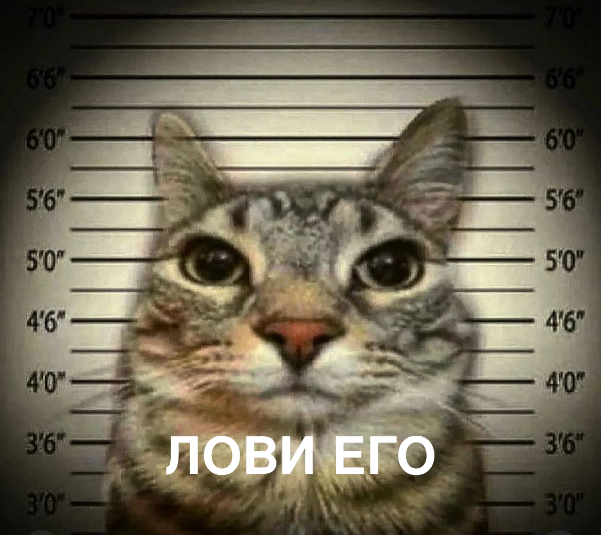

Всякий, кто смотрел детективы, восхищался дядями в черных пальто с лупой в руке и шляпой, надвинутой на глаза. Что так сильно восхищает зрителя? То, как эти ловко и грамотно эти дяди собирают артефакты, внимательно осматривают местность, умеют ставить себя на место преступника, и в конечном итоге восстанавливают полную картину убийства, максимально приближенную к истине.

В жизни - одно, но что творится в цифровом мире?

Всякие нехорошие люди атакуют системы, оставляют после себя вредоносные программки, таскают критические данные. Но делая все это - они также оставляют следы, которые позволят в дальнейшем поймать их и предотвратить злые делишки. Система атакована, пароли украли, оставили какой-то vi_l0hi.exe. Можно сколько угодно разводить руками, а можно обратиться к тем самым "дядям", но уже в цифровом мире - форензикам. Они все посмотрят, составят отчетик и уйдут с чувством выполненного долга.

## Немного о том, что это за зверь

Если быстро и без заморочек, форензика - это про умение раследовать всякие плохие дела, которые делались на атакованных системах. К расследованию тщательно готовятся и собирают объекты для анализа - копию оперативной памяти (в простонародье - дамп), дамп образа диска, если это нужно, дампы сетевого трафика. А иногда, чтобы быстро понять, в чем дело, собирают только те самые артефакты - кусты реестра (где хранятся все-все настройки, автозапуски, информация о системе), файлы метаданных (файлы, где файловая система хранит всякие нужные для себя данные, например, информацию обо всех директориях в файловой системе, то, как менялись файлы, какие кластеры повреждены и куча-куча всего), папки с данными браузеров, логи и прочие полезные вещи. 

Собрав всякие нужные штуки, форензики запускают виртуалку, расчехляют набор своих инструментов и приступают к анализу. Или к поиску того, не знаю что.

## С чего начать малышу?

Малышу нужно начать с азов. Читать придется много, а в особенности книжки - именно в них собрана база. 
Очень полезно почитать "Реагирование на компьютерные инциденты. Прикладной курс" Стива Энсона. Именно здесь собрано всякое разное для начала, что пригодится для понимания того, что искать, где искать и как искать, и как это все анализировать. 

Для понимания того, как анализировать дампы оперативной памяти, можно заглянуть в книгу "Криминалистика компьютерной памяти на практике" Светлана Островская, Олег Скулкин. Если ее прочитать - супер, но больше всего она пригождается как справочник.

Здесь можно прочитать про основные артефакты в Windows: [Уроки форензики. Большой гид по артефактам Windows](https://xakep.ru/2023/10/24/windows-forensics-guide/), а здесь - в Linux: [Топ-10 артефактов Linux для расследования инцидентов](https://habr.com/en/companies/angarasecurity/articles/767124/)

Но лучше всего форензика познается на практике - для этого прекрасно подойдет ресурс https://cyberdefenders.org/. Там лежат всякие задачи, от Network Forensic до Malware Analysis, а также присутствует градация по уровню сложности. Можно использовать подсказки, если застрял, или почитать райтапы!

Гугли, заглядывай в книжки, решай задачки - и будет тебе счастье!

## Инструменты, которые пригождаются чаще всего

Без инструментов никуда. Для успешного анализа малыш должен иметь хотя бы базовые инструменты:

- [FTK Imager](https://www.exterro.com/digital-forensics-software/ftk-imager), [Autopsy](https://www.autopsy.com/) - инструменты, позволяющие просматривать образ диска - все-все директории, вплоть до файлов метаданных, которые не встретишь на живой системе. Кстати говоря, FTK Imager поволяет только просматривать директории, а Autopsy позволяет быстро просматривать всякую полезную информацию в отдельных блоках, и даже показывает удаленные файлы. И все же полезно держать в своем арсенале оба инструмента.
- [Volatility 2.6](https://www.volatilityfoundation.org/26), [Volatility 3](https://github.com/volatilityfoundation/volatility3) - самый юзабельный инструмент для просмотра дампов оперативной памяти - содержит кучу полезных плагинов, упрощающих анализ. Важно иметь обе версии - каждая имеет свои плюсы и недостатки, но вместе они дополняют друг друга. Кстати, можно подглянуть в удобный [CheatSheet](https://blog.onfvp.com/post/volatility-cheatsheet/), если что-то забылось или не зналось.
- [Registry Explorer](https://ericzimmerman.github.io/#!index.md) - инструмент для просмотра кустов реестра. Можно искать нужные вещи по ключевым словам и удобно устроившись в кресле в удобном интерфейсе просматривать интересные ключи.
- [Hayabusa](https://github.com/Yamato-Security/hayabusa/releases/tag/v2.13.0) - для тех, кому лень скрупулезно просматривать логи Windows. Но на деле хватает и родного Event Log Explorer. 

Довольно часто пригождается таймлайн (что происходило на файловой системе) атакованной системы - для этого могут пригодиться инструменты из набора [The Sleuth Kit](https://github.com/sleuthkit/sleuthkit/releases/tag/sleuthkit-4.12.1).

На этом все, мой друг. Интересуйся каждой мелочью, и пусть удача всегда будет с тобой :)

