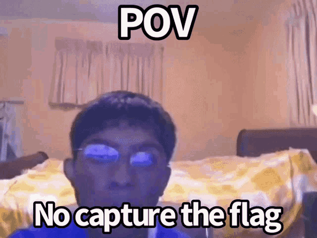
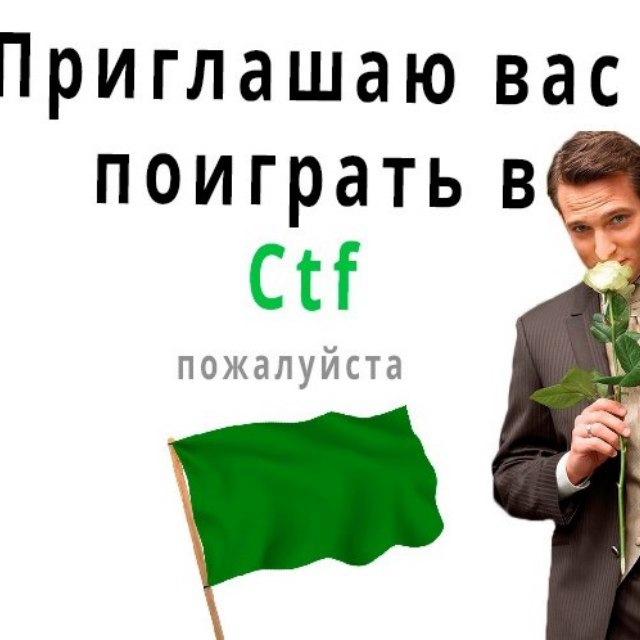
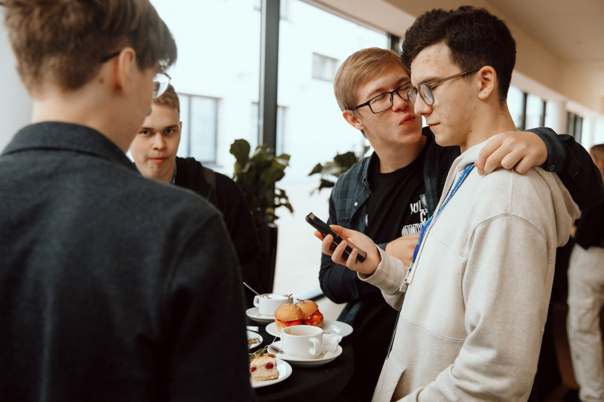
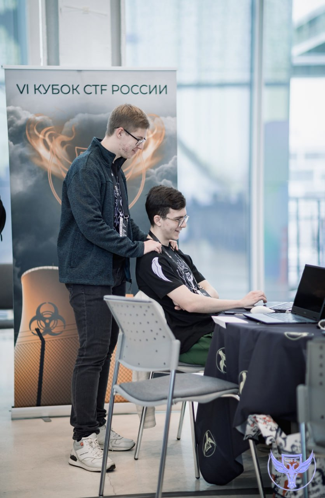
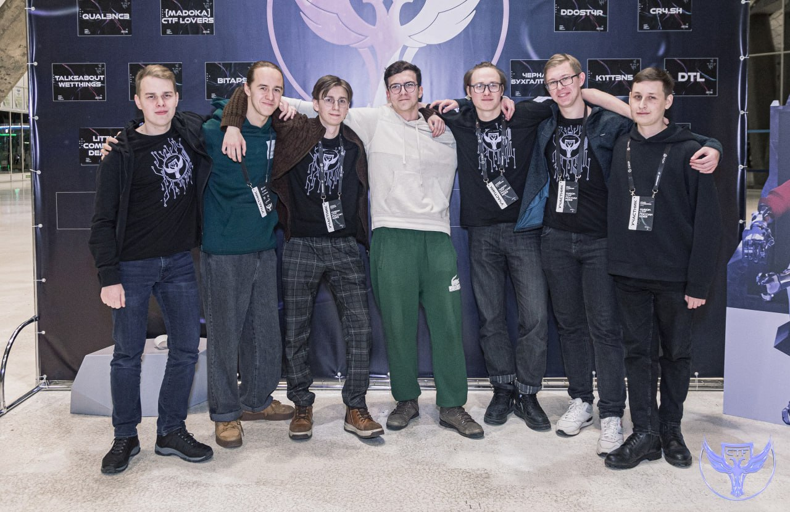
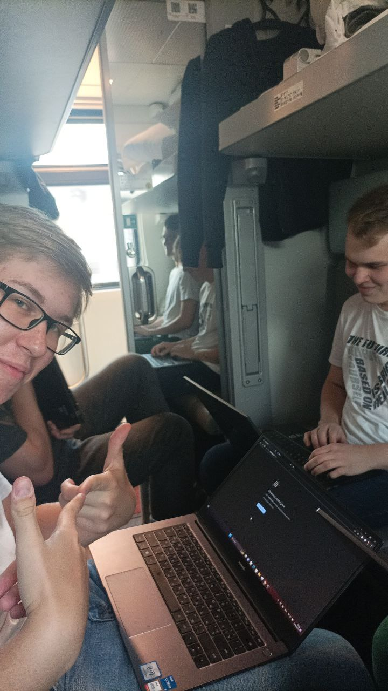

Приветствуем всех заинтересовавшихся новой веткой развития MireaCTF. Сегодня подготовили для вас вводную статью, которая должна помочь многим начать свой реальный профессиональный путь, а также расскажем о планах на данный проект.

## Как вкатиться в ИБ?
Тема информационной безопасности включает в себя множество направлений, каждое из которых требует изучения огромного количества материала, если конечно вы заинтересованы в становлении высококвалифицированным специалистом. Как же скрасить этот тернистый путь? Ответ прост: **CTF**!

## Почему CTF - это круто

Как показывает опыт, начать изучение чего-то из отрасли защиты информации намного проще, если первым шагом окажется решение различных CTF тасочек. Цтфки имеют очень много общего с реальными задачами, ибо при решении вы как минимум пользуетесь тем же софтом, будь то IDA или BurpSuite, а как максимум еще и осваиваете продвинутые кул хацкерс методики 😎

Сегодня ты решаешь "Бесконечное МИРЭА", а завтра понимаешь, что разобрался с базовыми методиками обфускации интерпретируемых языков.

Но не все категории заданий полезны с практической точки зрения. Задания типа stego, joy и misc имеют мало общего с реальностью. Это игровые категории, поэтому не стоит уделять им слишком много внимания. Вам никогда в жизни не пригодится умение складывать и ксорить битики цветовых каналов изображений.

Такие образом, с практической точки зрения цтфки помогут вам подкрепить теорию практикой, а также получить первый опыт, ценимый работодателями.

Если вы еще не нашли свое вдохновление, рекомендуем начать играть в соло и поверхностно изучить каждую из тем, а уже после смотреть в сторону командной игры. Команда это круто, особенно если это команда друзей. По другомы быть и не должно. Вы просто посмотрите как крашам хорошо вместе ☺️

Вы просто не представляете насколько круто ездить куда-то с командой, всем рекомендуем. А еще командна поддержит и матывация поднимит: очень тяжело отлынивать, когда все заняты делом. В команде проще делиться опытом, так как вы на одной волне. А еще это очень много хихихи ха. 

Так или иначе, мы с вами живем в реальном мире и от работы в команде не убежишь.

## Наши планы на этот проект
Планируется выпуск статей по различным отраслевым темам (web, reverse, pwn, forensincs, web3, devops для ctf), а в дополнение к ним - таски, на которых вы сможете отточить и закрепить полученные знания. 

Когда будет выпущено некоторое количество материала по jeopardy (task-based формату соревнований), будут появляться статьи, готовящие к attack/defense ctf, и проведены очные тренировки для большего эффекта.

Важно сказать, что все материалы и таски, публикуемые нами, должны стать лишь методом подогревания собственного интереса для развития, но никак не единственным источником знаний.