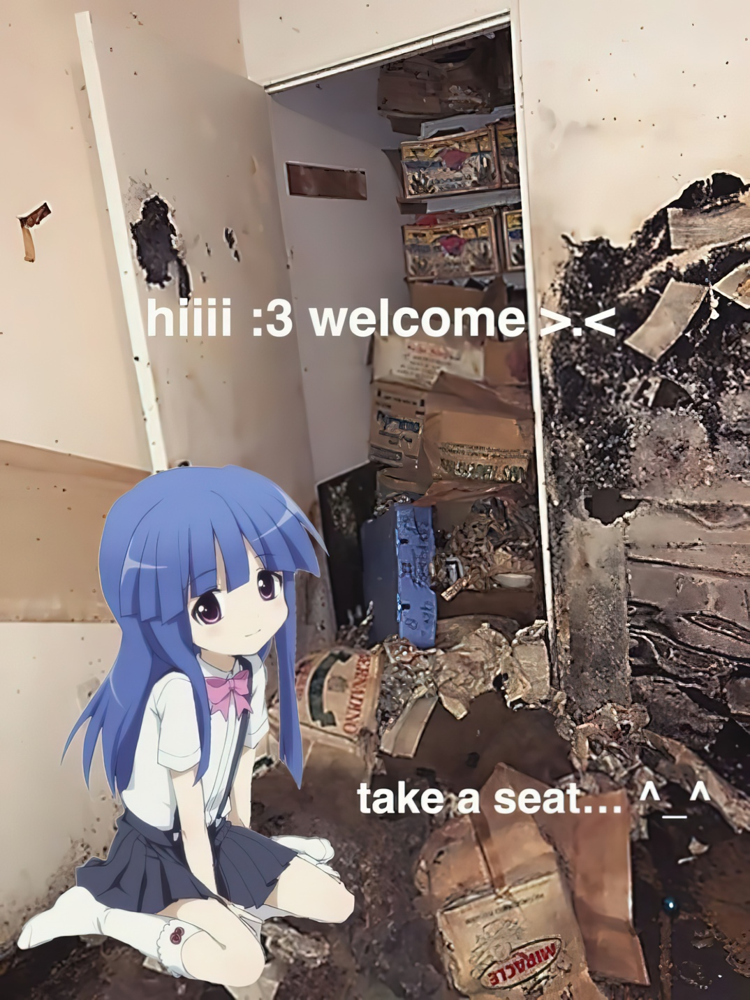

хо-хо-хо, пришла пора погрузить вас в пучину страха и отчаяния. Ладно, шучу (не оч получается, извините)

## Что такое реверс?
Реверс инженер это как программист, только наоборот. Вместо написания логики, вы занимаетесь её восстановлением. Процесс невероятно занимательный, особенно если вам нравится разбираться во внутреннем устройстве вещей.

Несколько ОчЕнЬ жизненных ситуаций, в которых может пригодиться реверс:
* Вы скачали бесплатной оперативной памяти, но у вас почему-то зашифровлся жёсткий диск. Очень странно. В таких ситуациях рыв йор сер открывает бинарь в своём любимом дизассемблере и ищет инструкцию xor. Чтооооо? Все файлы зашифрованы однобайтным ключём??? Мда, малварьщику явно надо больше тренироваться. 
* ~~"Your trial version is expired" , - гласит надоедливое окошко. Прыжок пропатчил и погнал.~~ **УК РФ, Статья 272. Неправомерный доступ к компьютерной информации** 😝🫣🥺😉🤯😐
* Интересно, как же именно работает файл игрового сохранения? О как, по смещению 0x100 байтов лежит int баланса. Получается я теперь миллионер.

## Насколько глубока кроличья нора?
Очень.

Зачастую операционные системы имеют разные форматы исполняемых файлов, каждая процессорная архитектура имеет свой язык ассемблера (и далеко не под каждую есть декомпиль 🥹), разные языки программирования могут довольно сильно различаться на низком уровне (пореверсив C, вы не сможете сходу разобраться с golang), а ещё не забывайте про виртуальные машины по типу Java и .Net

Методов исследования также не мало: кроме базового статического анализа и отладки, существуют taint анализ, символическое исполнение, инструментация, деобфускация и девиртуализация.

Все это составляет большущую компетенцию реверс инжиниринга, в которую я вас силой затяну. Да да, у зашедших сюда нет пути назад. Дальше только рыв йорс.


Дорогу осилит идущий в дурдом. © Фридрих Ницше



Кстати говоря, на рынке труда требуются не только вирусные аналитики. Ещё есть направления поиска уязвимостей, патч дифинга и их более мелкие подразделения. В целом все про реверс, но со своей спецификой, требующей опыт владения определенными инструментами и методами исследования.

## С чего же начать путь становления?


А еще:
* Если совсем не знакомы с C или C++, стоит познакомиться. Это база. У этих языков огромная область применения, соответственно бинарей много, а читать декомпиль как-то надо. Мне лично зашел [этот плейлист](https://www.youtube.com/watch?v=18c3MTX0PK0&list=PLlrATfBNZ98dudnM48yfGUldqGD0S4FFb). Не позвольте ```var_28 = *(DWORD *)(*sub_2281337)(*((DWORD** )argv[0]))``` запугать вас!!!
* В том же плейлисте гляньте видео про компиляцию и линковку
* [Оч крутое видео про ассемблер](https://www.youtube.com/watch?v=PHyIP9g9BQw)
* [Рандомная статейка про языки программирования](https://habr.com/ru/articles/539784/)

Все, я устал, всем пака