а ааа аааааапчхиии 😖 \*хлюп\*


А вы любите смотреть ютуб шортсы? Я вот очень! Мне кажется в сутках слишком мало времени, ибо 25 часов на видосики из интернет реальности маловато будет. С прошедшего MireaCTF 2023 у меня на компьютере появился родительский контроль и жизнь моя потеряла всякий смысл

> В мире YouTube Shorts он жил и веял, 
>
> Смех и слезы он в себе хранил.
>
> Но день настал, когда видеть зрелище
>
> Ему не суждено было.
>
> [Network Error]

Пришла пора впустить смысол в свою жизнь!

# Бабазовый анализ
Для начала было бы неплохо запустить исполняемый файл и оценить происходящее. 

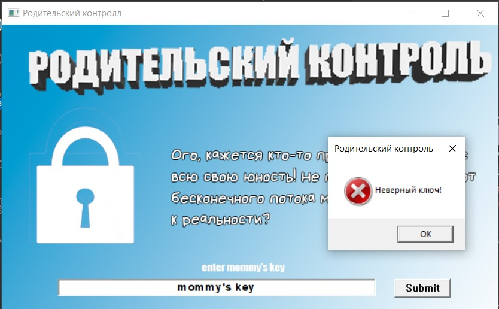

На скрине выше видно, что это простое графическое приложение с полем ввода. По всей видимости, введенный ключ проверяется каким-то алгоритмом и я его проверку явно не прошел 😭😭😭

Ну чтож, уже неплохо, по крайней мере мы теперь знаем, что наш исполняемый файл явно может похвастатья обилием вызовов системного api. 

## Совсем немного о winapi
Каждая уважающая себя операционная система предоставляет некоторый программный интерфейс, с помощью которого программисты могут c ней взаимодействовать. В шиндофс таковым интерфейсом является WinApi. В WinApi очень очень много функций на все случаи жизни, раскиданных по всяким dll-кам и lib-ам. Не малая часть из них лежит в ```System32```

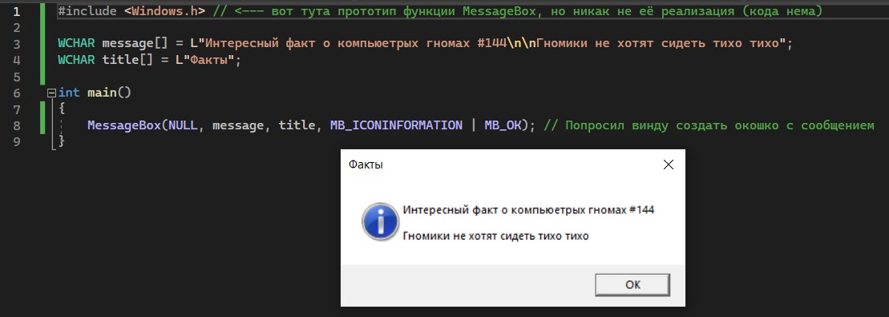

Используемые системные вызовы для нас как для исследователей могут быть очень информативны, поэтому следует обращать на них внимание.

## Таинства exeшника
Круто, простым запуском мы уже получили толику информации, однако этого недостаточно, нам нужно ещёёё!!!

Сегодня у нас виндовая приложуха, а значит она в формате [Portable Executable](https://ru.wikipedia.org/wiki/Portable_Executable). 

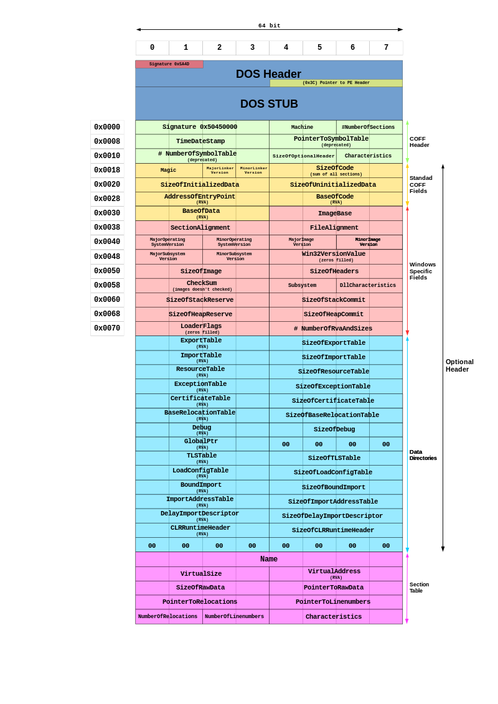

Исходя из структуры, внутри файла есть оЧеНь интересные таблички с импортами и экспортами функций. Все внешние зависимости в виде динамических библиотек и их процедур как раз описаны таблицей импортов.

Чтобы все это дело посмотреть, можно использовать какой-нибудь [PE Beer](https://github.com/hasherezade/pe-bear)

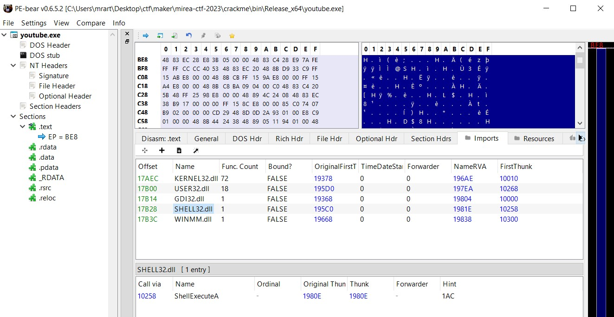

Ого, а что ето у нас такое! ```ShellExecuteA``` из ```SHELL32.dll```??? Получается где-то в программе выполняются базовые операции с файлами или веб ссылками 🤨 Берем на заметочку.

Я бы еще глянул в заголовок секций 

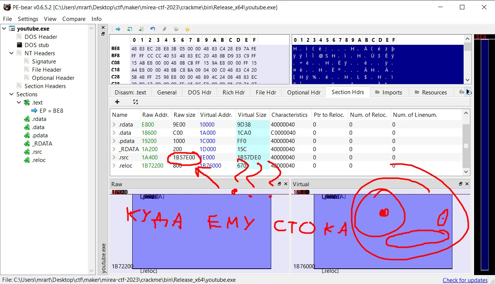
Нииичосиии, 0x1b57e00 байтов это целых 28 671 488 байтов, но в десятичной! 27.34 кбайтов экзешника лежат ни в секции кода (```.text```) или данных (```.data```), а в сеции ресурсов (```.rsrc```)!

Обычно в секции ресурсов ничего кроме манифеста (версия, описание и тп) не лежит и весит она соотвественно не больше килобайта, поэтому просто ради прикола откроем бинарь в [Resouce Hacker](https://www.angusj.com/resourcehacker/) и посмотрем чего там интересного есть.

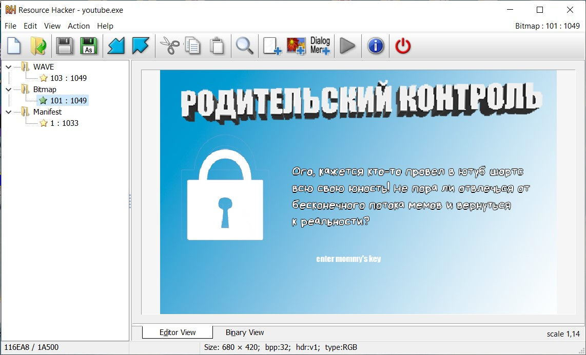

Просто фоновая картинка и не менее фоновая музыка. Ничего интересного.

## Чем ты запакован???
Было бы неплохо прогнать бинарник через какой-нибудь сигнатурный анализатор. Существует множество различных инструментов, всячески видоизменяющих внутренности исполняемых файлов, например, обфускаторы или упаковщики. Сегодня мы об этом подробно не говорим, но суть в том, что обрытное проектирование они очень даже могут затруднить, поэтому для удобства народа рыв йор серов существуют сигнатурные сканеры, нацеленные на детектирование применения подобных стандартных инструментов. Довольно популярным является [Detect It Easy](https://github.com/horsicq/Detect-It-Easy)

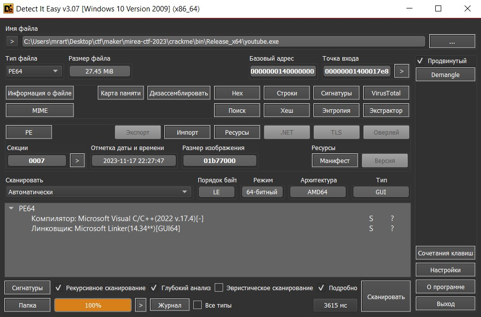

К счастью наш пациент ничем таким не болен. 

А ещё мы теперь достоверно знаем, что это 64-х битное приложение, собранное с помощью Visual Studio. Тут особо не на чем останавливаться, поэтому идем дальше.

## Строки
А дальше... почему бы не посмотреть строки? Строки также очень информативны и просты к воспрриятию. Обычно хоть какие-то строки есть всегда, так почему бы не использовать их как ориентир? 

А вообще как это? У нас же экзешник, а не текстовый файл, какие блин нафиг строки?

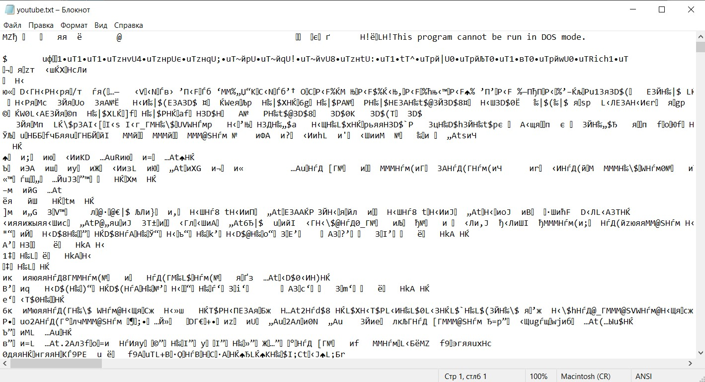

Если попытаться открыть бинарь в блокноте, то можно заметить, что даже в самом начале файла часть информации можно интерпретировать как читаемый текст. 

Все потому, что любые проинициализированные значения внутри кода вашей программы должны быть хоть в каком-то виде сохранены в память, чтобы в дальнейшем процессор мог к ним обратиться. Как ```printf``` может вывести ```Hello world!```, если его физически не существует?

Поэтому у нас есть фоновая картинка в секции ресурсов и строка "Родительский контроль" из заголовка окна внутри секции данных исполняемого файла
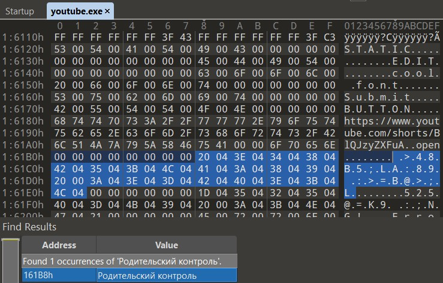

Разумеется искать строки в hex редакторе не оч удобно, для этого есть утилита ```strings``` и её легендарный сиквел ```strings2```!
Перенаправив вывод из консоли в файл, получим следующее:

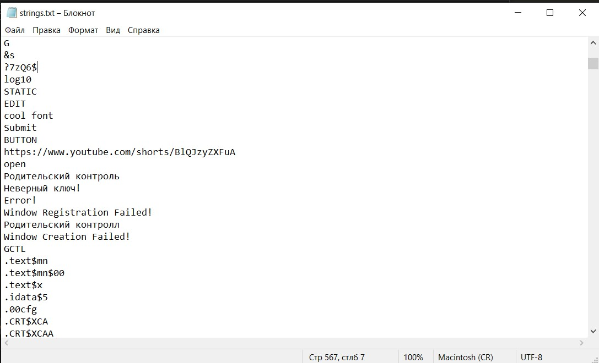

Отлично, крошек информации насобирали. В дальнейшем нам это сильно поможет в поиске алгоритмма проверки ключа.

# Продвинутая статика
Сигнатуры проверили, заголовки почитали, ресурсы нашли, строки разглядели, теперь пора обратиться к вашему любимому дизассемблеру! Чтооо?? У вас все ещё нет любимого дизассемблера??

## Дизассемблеры
На самом деле речь не о простых дизассемблерах, а о полноценных средах для рыв йор са!

Самые известные на мой взгляд: [IDA Pro](https://hex-rays.com/ida-pro/), [Ghidra](https://github.com/NationalSecurityAgency/ghidra), [Radare2](https://rada.re/n/r2pipe.html) и [Binary Ninja](https://binary.ninja/)

Однако по настроящему признанными можно назвать только IDA и Ghidra, патамучта они самые мощные и практичные. Не согласны? А вот не выделяйтесь из серой массы и пользуйтесь тем же, чем и большинство.


## Ыда или гыдра

По большей степени инструменты умеют одно и то же, но есть нюанс.

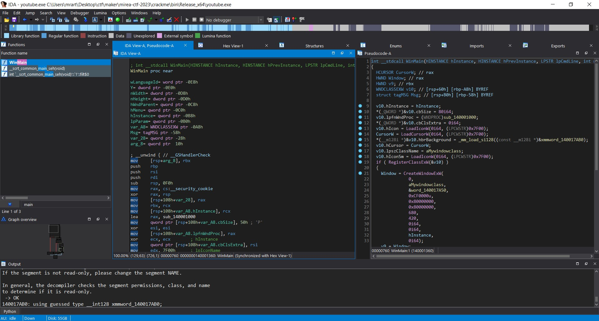
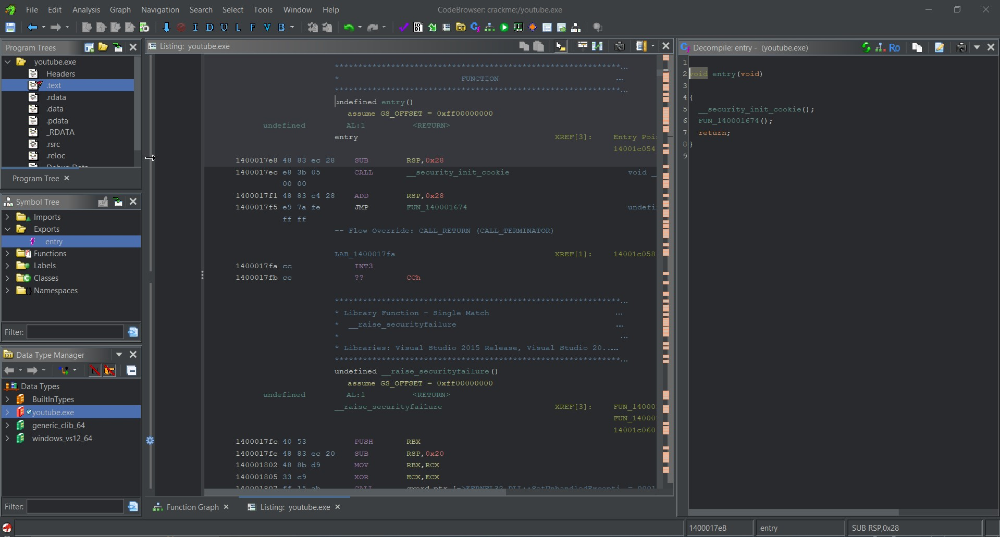

У инструментов даже похожий интерфейс, однако гидра проигрывает по качеству декомпиля. У иды довольно хорошо предсказываются используемые типы данных, а также есть множество сигнатур, позволяющих с легкостью определить, к примеру, программную точку входа. 

После анализа исполняемого файла, ида перенесет нас прямиков в ```WinMain```, в котором начинается код самого приложения, в то время как гидра остановится на буквальной точке входа, где распологается код сгенерированный компилятором для всяких там инициализаций и переноса потока выполнения в функцию ```WinMain``` (```main```).


В графических приложения Windows стандартной точкой входа является функция ```WinMain```, а не ```main```, как в обычных консольных


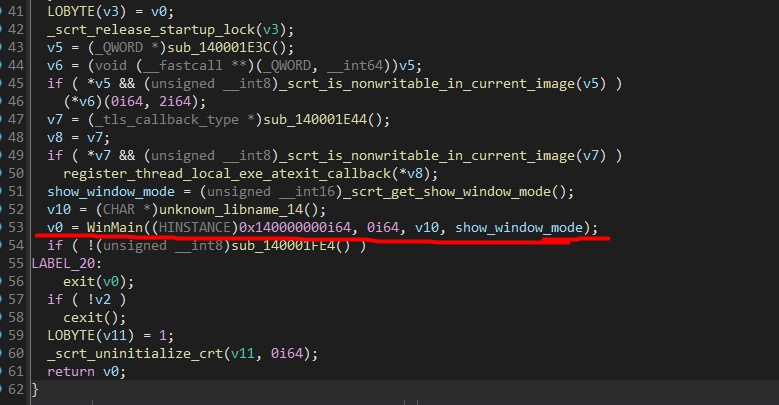

Зато гидра опенсурсная и у нее в разы больше поддреживаемых архитектур, ещё и под каждую декомпиль есть. Вирусным аналитикам не понять...
Гидра кроссплатформенная, ида тоже... хы-хы-хы, в общем работает только под виндой) 

Я лично не оч люблю джаву и это ещё одна причина для меня не использовать гидру, потому что скриптование и разработка своей процессорной архитектуры разумеется неразрывно будут связаны как раз с этим языком. Больше предпочитаю C++ и python для этих возможностей со стороны иды.

Более объективное сравнение этих инструментов [тут](https://habr.com/ru/articles/480824/).

## В поисках алгоритма
Так как бинарь распологает, будем рыв йор сить в ида про.

Для тех, кто еще плохо ориентируется в этом замечательном инструменте, существует [ IDA Pro from scratch](https://github.com/un4ckn0wl3z/reverse-engineer-research/tree/master/0_ricardo_ida). 

На [ ютубчике ](https://www.youtube.com/watch?v=recsgP_WAw8&list=PL59fvn5FIiQEv_4HxmllfT0YZHDmCQaVq) есть тот же самый материал, пересказанный добрым хакером яшей.

После того, как бинарь загружен и проанализирован, мы попадаем в распознанную функцию ```WinMain```. Именно отсюда начинается исполнение кода, написанного программистом.
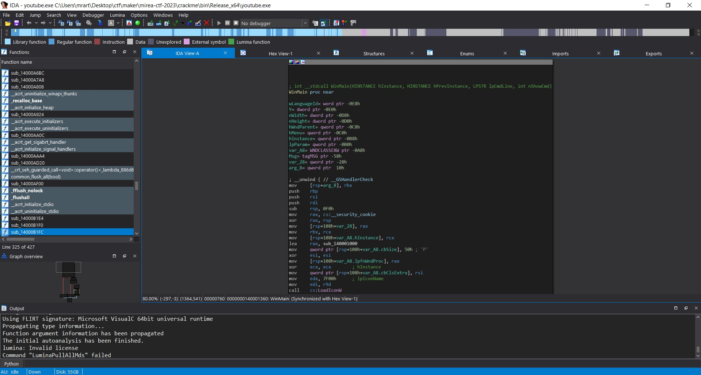

Ясня панятня, а чта делять дальше то?? ? ? Хде тут эти ваши обработчики ключей??

Узбагойтесь, ситуация под контролем.


Не зря же мы предварительно наковыряли всякого! У нас есть куча интересных строк и не менее интересные вызовы системного api. Как хорошо, что в тулбаре иды есть менюшки ```View -> Open Subviews -> String``` и ```View -> Open Subviews -> Imports```.

Мы знаем, что после ввода некорректного ключа, программа вызывает ```MessageBox```, поэтому перейдем в окно импортов и через *CTRL + F* найдем интересующую нас импортируемую функцию.

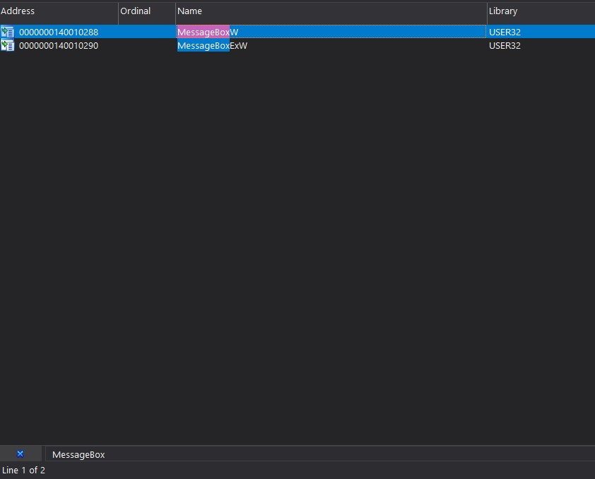

Тут их две штуки, по сути одинаковых функций, просто ```Ex``` версия круче - она дает больше контроля над создаваемым окном.

Допустим первая функция является искомой. Два раза по ней тыкаем и попадаем в окно дизассемблера, прямиком в секцию ```idata```.

После того, как системный загрузчик подгрузит наш исполняемый файл в новоиспеченный процесс, а вместе с ним и импортируемые библиотеки, на месте этого замечательного ```extrn MessageBoxW:qword``` будет лежать указатель на функцию в памяти процесса.

Это означает, что все желающие вызвать ```MessageBoxW```, должны будут сослаться на этот указатель.

Для нахождения таких инструкций тыкаем по ```MessageBoxW``` и нажимаем ```X```.

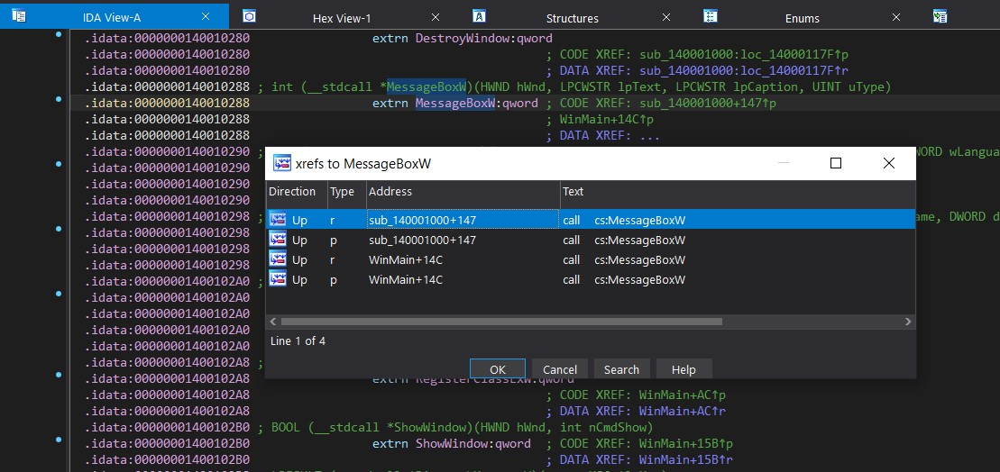

Обратите внимание, что в ссылках всего две инструкции, обращающихся к нашей библиотечной функции. 

Внутри ```WinMain``` в качестве заголовка передается  ```Window Creation Failed!```, а у интересующего нас окна заголовок немного другой, поэтому смело пропускаем (а еще  ```WinMain``` отвечает только за инициализацию окна)

Просто методом исключения остается вызов ```MessageBoxW``` из ```sub_140001000```.

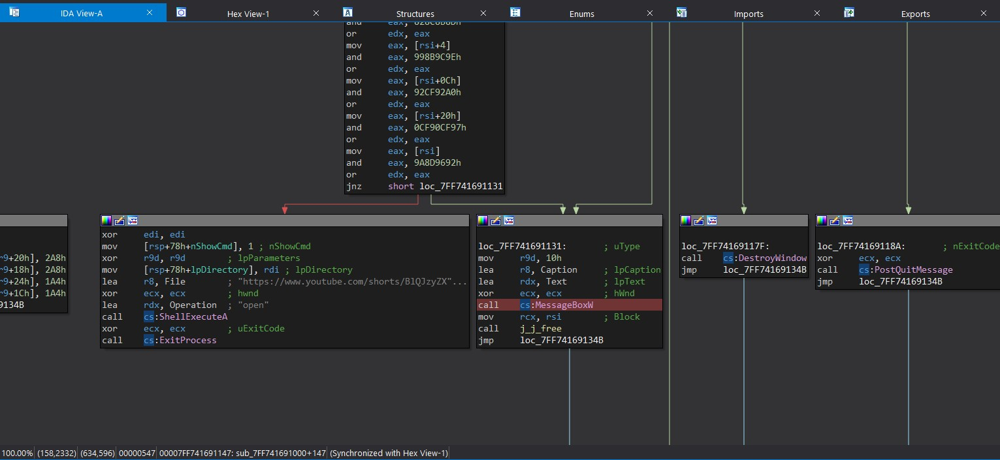

Тут явно что-то интересное! Базовый блок с логическими операциями над каким-то массивом с ветвлениями после, одно из которых спавнит мессадж бокс, а второе вызывает ```ShellExecute``` с какой-то ссылкой, которую мы уже видели. 

Таким образом, текущее место в программе также можно было сразу найти через поиск обращения к этой строке.

Глянем в декомпиль для просто высприятия. Для этого нажать ```Tab``` или ```f5```

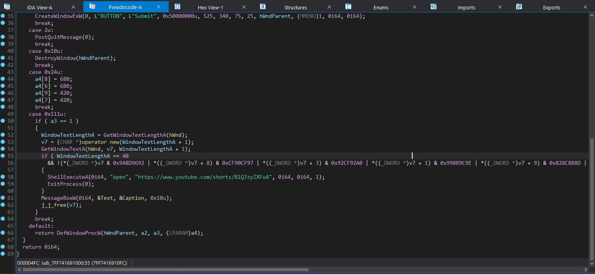

К сожалению ида дружит только с ASCII строками, а все что она не может раскодировать, будет выглядеть как ссылка на какую-то метку. В данном случае декомпилятор видит известную ему функу ```MessageBoxW```, поэтому ссылки на нераспознаные данные имеют осмысленный вид. 

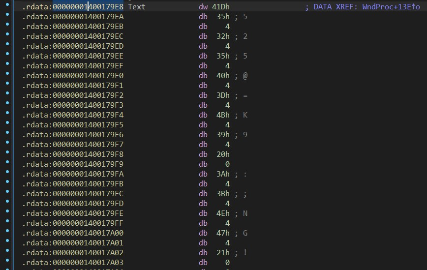

Нажимаем ```Alt + L``` для перехода в режим выделения, тыкаем по начальному и конечному адресу и ```Shift + E``` для экспорта байтиков. Выбираем ```hex string (unspaced)``` вид и получаем хекс строку: ```1D0435043204350440043D044B04390420003A043B044E0447042100```

С помощью питончика декодим строку

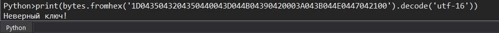

Теперь на 100500% можно быть уверенным в том, что это то самое окно, которое появляется после ввода неверного ключа.

Отлично, алгоритм проверки ключа найден! Осталось понять сам алгоритм.

## Кракаем алгоритм
У нас всего один условный блок, проверяющий корректность введенного ключа.
```c
if ( input_len == 40
          && !(*(_DWORD *)input_string & 0x9A8D9692 | *((_DWORD *)input_string + 8) & 0xCF90CF97 | *((_DWORD *)input_string + 3) & 0x92CF92A0 | *((_DWORD *)input_string + 1) & 0x998B9C9E | *((_DWORD *)input_string + 9) & 0x828C8B8D | *((_DWORD *)input_string + 7) & 0x8CA0CC8D | *((_DWORD *)input_string + 2) & 0xCA938F84 | *((_DWORD *)input_string + 4) & 0xCEA08692 | *((_DWORD *)input_string + 5) & 0xCCCC91A0 | *((_DWORD *)input_string + 6) & 0xCF92A09B) 
   ) {
  // сюда нам надо
}
// сюда нам не надо
```

Мы очень хотим попасть внутрь условного блока, а значит вот ето длинное условие должно в результате дать что-то отличное от нуля.

При раскрытии условия, в сухом остатке имеем: ```input_len == 40 && !( кишки... )```

Значит, длинна веденного текста строго равна сорока, а ```кишки``` в результате вычисления должны давать нолик, чтобы уже при инверсии получить истину. 

Продолжаем раскрывать условие. Внутри скобочек у нас множество побитовых операций И и ИЛИ. Исходя из приоритета операций, ИЛИ (```|```) выполняется после И (```&```), а значит выражение можно представить в виде:```A | B | C | D | ...```, где условное ```A``` - это побитовое И от какой-то части введенного текста. Помним, что в результате этих побытовых операций должен получится ноль, а значит каждое из побитовых И также должно давать ноль.

Как же нам получить ноль в результате выполнения ```*(_DWORD *)input_string & 0x9A8D9692``` и ему подобных?

Достаточно просто побитово инвертировать```0x9A8D9692```

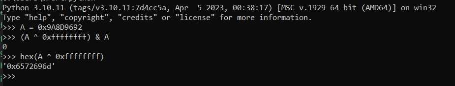

Следовательно ```*(_DWORD *)input_string``` должно быть равно ```0x6572696d```.

Если приведение типов и работа с указателями вызывают у вас дискомфорт, то для начала можно глянуть эти два видосикса про [ поинтеры](https://www.youtube.com/watch?v=DTxHyVn0ODg&t=15s) и [ приведение типов](https://www.youtube.com/watch?v=8egZ_5GA9Bc)


Получается, если представить первве четыре байта введенного текста в виде 4х байтоного целочисленного значения, то мы должны получить```0x6572696d```. 

Хы-хы, это и есть часть нашего ключа, просто её надо представить в виде текста.

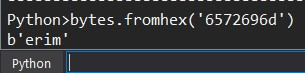

```erim```, но на самом деле ```mire```. Архитектура x86 упорядочивает байты целочисленных значений в так называемом ```little-endian```- порядке байтов от младшего к старшему, поэтому строку надо перевернуть.

С остальными побитовыми И буквально то же самое, только там мы уже работаем с продолжением строки.

```(_DWORD *)input_string + 1``` подразумевает смещение от начала строки на один ```DWORD```, то есть на четыре байта. Это буквально получание элементов по индексу из массива.

Для избавления от приведения типов можно сразу выставить ожидаемый тип ```DWORD*``` для ```input_string```

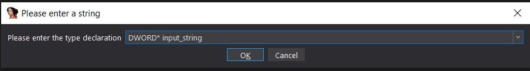

И получить в результате красивое обращение к массиву ```DWORD```ов

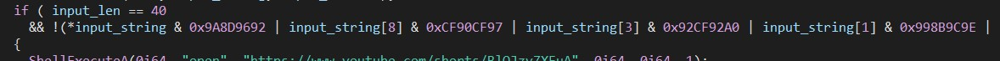

Теперь остается только написать обратный алгоритм:

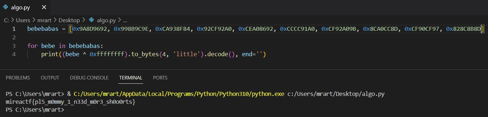

Ключ у нас, можно смотреть шортсы дальше, хотя ссылку на сам шортс мы еще в самом начале получили...


# Зочем мне ассемблер
В целом при анализе достаточно было пользоваться декомпилятором, однако это не значит, что его всега будет достаточно.

Не стоит слишком сильно полагаться на псевдокод: декомпилятор во многом только строит предположения о том, как этот исходный код мог выглядеть на языке Си, именно поэтому окно с декомпилем именуется **Pseudocode**. 

Достаточно добавить в начало функции
```asm
xor eax, eax
jz norm_code ; прыжок произойдет в любом случае
add esp, 0x10000000 ; эта инструкция никогда не выполнится
norm_code:
```

И декомпилятор скажет вам


А вот вам пример того, как он просто проигнорировал инициализацию буфера 

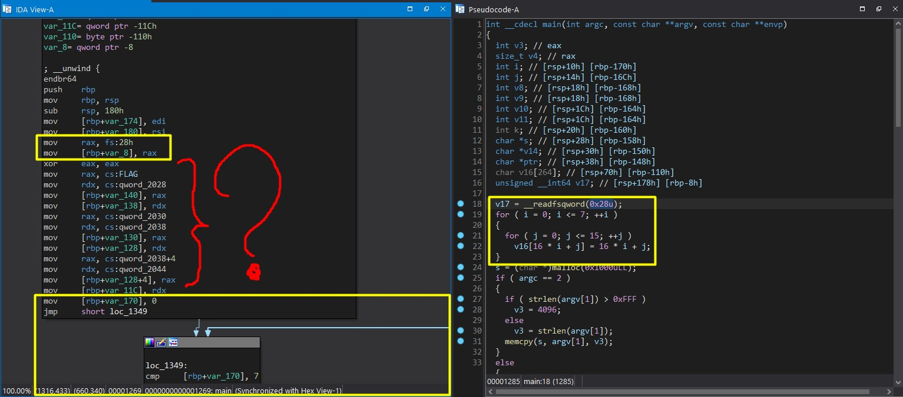

Для решения задания это было очень критично)

К тому же без знания ассемблера невозможно патчить и отлаживать, ето все происходит на уровне машинного кода.

Поэтому рекомендую не пользоваться декомпилем до момента, пока не научитесь читать дизасм.

# Сопутствующие материалы
* [Cheatsheet](https://hex-rays.com/products/ida/support/freefiles/IDA_Pro_Shortcuts.pdf) по горячим клавишам IDA Pro.
* [ Спидран по асму](https://www.youtube.com/watch?v=75gBFiFtAb8)
* О. Калашников, [Ассемблер - это просто. Учимся программировать, 2-е издание](https://books.4nmv.ru/books/assembler_-_eto_prosto_uchimsya_programmirovat_2-e_izd_3642956.pdf)
* [x86 and amd64 instruction reference](https://www.felixcloutier.com/x86/)
* [x86 calling conventions](https://en.wikipedia.org/wiki/X86_calling_conventions)
* Д. Юричев, [Reverse Engineering for Beginners](https://files.nazaryev.ru/books/reverse-engineering-for-beginners.pdf) - база по реверсу
* М. Сикорски, Practical Malware Analysis - база по вирусной аналитике, большой уклон под винду.
* Таски [```Родительский контроль```](https://platform.mireactf.ru/challenges#%D0%A0%D0%BE%D0%B4%D0%B8%D1%82%D0%B5%D0%BB%D1%8C%D1%81%D0%BA%D0%B8%D0%B9%20%D0%BA%D0%BE%D0%BD%D1%82%D1%80%D0%BE%D0%BB%D1%8C-4), [```Cringe Checker```](https://platform.mireactf.ru/challenges#Cringe%20Checker-3) и [```Cat Wife Activator```](https://platform.mireactf.ru/challenges#Cat%20Wife%20Activator-1) на [нашей платформе](https://platform.mireactf.ru/)

Остались вопросы? Пишите в [ чатик](https://t.me/mireactf_chat) 

всем пака 😘