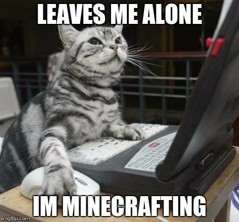

Всем привет! ~~Не прошло и 4 месяцев как~~ в прошлой статье мы разобрали веб-уязвимости типа client-side. Как и обещал, с небольшим запаздыванием, сегодня поговорим уже о server-side.

Из названия уже понятно, что это какие-то уязвимости, которые мы выполняем от лица сервера. С их помощью мы можем делать много всего интересного: изменять, просматривать, удалять и красть данные, выполнять собственный код на сервере, изменять конфигурацию сервера или полностью его скомпрометировать для более сложных цепочек атак на другие системы.

Чтош, заваривайте чай, статья обещает быть большой.

## Path Traversal и Local File Read

**Path (directory) traversal** - это уязвимость, которая позволяет атакующему читать произвольные файлы на сервере. Допустим мы видим на сайте с музыкой, на странице с подгрузкой трека, что загружается `.mp3` файл:

`https://seregapiratmusic.net/album/bests?track=ya_shizoid.mp3`

Давайте заменим track на что-то такое, что точно есть на сервере, где вертится сайт. Например, на `/etc/passwd`.

**Важное замечание:**

`.mp3` файлы, вероятно, лежат в отдельной директории, изображения в отдельной, html тоже в другой. Но никак не в `/etc/`. Значит, чтобы читать файлы в `/etc/`, надо подняться до корня файловой системы и выбраться из директории, где находится веб-приложение. Если вы уже немножко знакомы с Linux, вы наверняка догадались, что сделать это можно с помощью простого `../../../`

Итоговый url у нас получится такой:

`https://seregapiratmusic.net/album/bests?track=../../../../../etc/passwd`

В результате, если уязвимость присутствует, мы получим содержимое файла `/etc/passwd`

```
root:!:0:0::/:/usr/bin/ksh
daemon:!:1:1::/etc:
bin:!:2:2::/bin:
sys:!:3:3::/usr/sys: 
adm:!:4:4::/var/adm:
uucp:!:5:5::/usr/lib/uucp: 
guest:!:5:5::/home/guest:
nobody:!:4294967294:4294967294::/:
lpd:!:9:4294967294::/:
lp:*:11:11::/var/spool/lp:/bin/false 
invscout:*:200:1::/var/adm/invscout:/usr/bin/ksh
nuucp:*:6:5:uucp login user:/var/spool/uucppublic:/usr/sbin/uucp/uucico
paul:!:201:1::/home/paul:/usr/bin/ksh
seregapiratfan:*:202:1::/home/seregapiratfan:/usr/bin/ksh 
```

В зависимости от цели атакующего полезно будет получи исходный код приложения, конфигурации web-сервера или какой-то бинарный файл и так далее. Принцип думаю все поняли.

**Local File Read** - брат-близнец **Path Traversal**. Разница в том, что под PT подразумевается выход за пределы допустимой директории (в нашем случае директория, где находятся файлы веб-приложения). То есть мы можем «гулять» по всей (на самом деле нет, но сделаем допущение) файловой системе. А вот Local File Inclusion (LFR) чаще всего позволяет читать файлы только в одном каталоге (где опять же хранится наше приложение) и спускаться ниже по нему.

## Local File Inclusion

Не отходя от темы чтения произвольных файлов, сразу разберемся, что такое **Local File Inclusion**, и чем он отличается от Path Traversal.

Отличие заключается в том, что LFI позволяет злоумышленнику включить файл, обычно используя сценарий на сервере, и выполнить его из локального каталога на сервере. Эта уязвимость возникает, когда веб-приложение использует несанкционированный пользовательский ввод для создания пути к файлу для выполнения. LFI позволяет выполнять сценарии, которые потенциально могут привести к полной компрометации системы.

Атаки с обходом каталога или обходом пути направлены на доступ к файлам в каталоге, к которому злоумышленник не должен иметь доступа, путем манипулирования переменными, ссылающимися на пути к файлам. Злоумышленнику не обязательно выполнять файл, поскольку основная цель — прочитать конфиденциальные файлы для сбора данных. Этот тип атаки часто используется для сбора информации для будущих атак.


Хотя обе уязвимости безопасности используют механизмы включения файлов веб-приложений, LFI позволяет выполнять сценарии, а Path Traversal обычно используется для несанкционированного доступа к данным.

LFI уже более опасная атака, которую в некоторых случаях можно развить до RCE и полной компрометации сервера.

## Server side template injection

Если у вас есть хотя бы небольшой опыт в разработке веб-приложений (сайтов), вы наверняка сталкивались или слышали такое понятие как «шаблон». Не сильно углубляясь в разработку в контексте безопасности, шаблон можно описать так: это заранее предопределенное выражение, в которое вставляется пользовательский ввод, переменные или другие данные. Если вы не поняли, что я только что написал, есть два предположения, почему так произошло:

1) Я плохо объясняю и вообще пора завязывать писать статьи ~~можно подумать я их пишу постоянно~~

2) А второго я не придумал

В любом случае, ознакомиться с шаблонизаторами можно быстро. Вот дока для популярного Python шаблонизатора **Jinja2**

https://lectureswww.readthedocs.io/6.www.sync/2.codding/3.templates/jinja2.html

Вернёмся к **SSTI**. Уязвимость возникает, когда пользователям доступно изменение и отправка новых шаблонов. Но не всегда удается убрать эту возможность из-за особенностей логики приложения и бизнес процессов. 