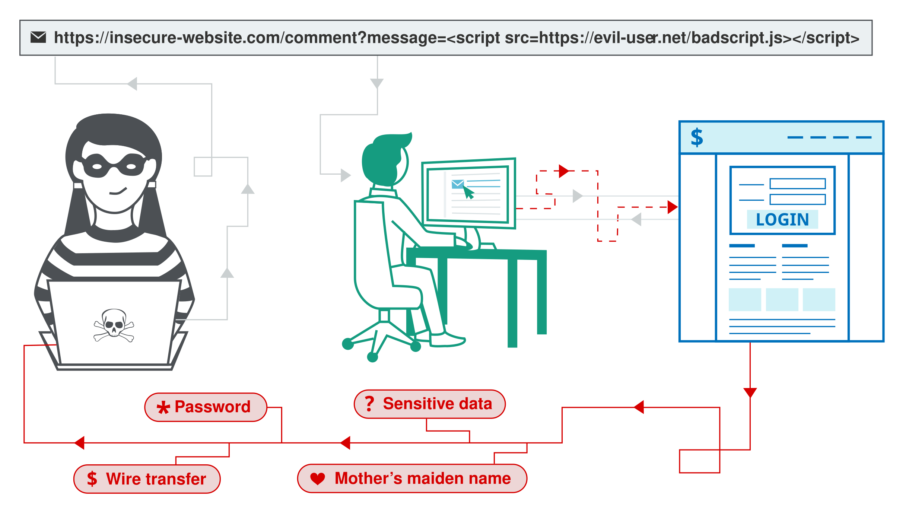
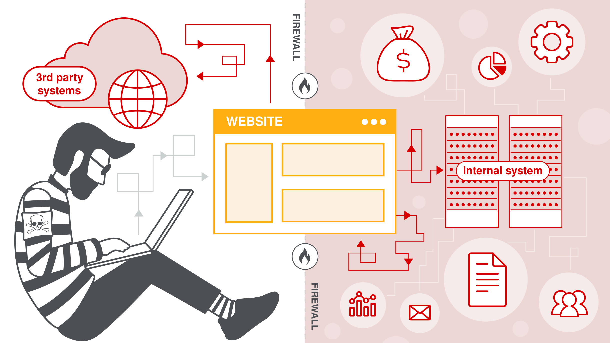

Всем привы, у меня для вас небольшой экскурс в анализ веб уязвимостей.

## Что включает сфера?
Было ли вам когда-нибудь интересно в приложении банка при переводе указать вместо обычного числа отрицательное, чтобы впоследствии получить повышение баланса или вставить в поисковую строчку что-то необычное, например кавычку и получить ошибку или нестандартный вывод? Все это примеры нахождения уязвимостей в приложениях.

Решая таски категории веб зачастую приходится декомпозировать работу приложения, мыслить нестандартно и сочинять вероятные векторы для использования приложения не так, как было задумано разработчиками. 

С развитием интернета и технологий в целом, web сайты стали неотъемлемой частью всемирной паутины, поэтому выстаривание защищенных сайтов весьма важная задача, однако разработчики это люди, а людям свойственно ошибаться. Поэтому анализ защищенности, как направление информационной безопасности получил свое уважение и популярность.

## В чем web прокачивает?
Решая данную категорию на соревнованиях вы поймете, как работают протоколы прикладного уровня, такие как http, ssl/tls, вебсокеты. Познакомитесь с основными принципами работы современных (а иногда даже слишком) веб приложений, баз данных и различных веб фреймворков. 
Для исправного и производительного поиска дыр в веб приложениях необходимо знать множество используемых технологий:
  - Устройство сетей (сетевая модель OSI и TCP/IP)
  - Протоколы прикладного уровня: HTTP, WebSockets, SSL/TLS и другие
  - Работа с базами данных (PostgreSQL, MySQL, SQLite, Redis, Mongo etc), а также написание запросов SQL, NoSQL
  - Особенности различных фреймворков для написание web приложений (Java Spring, Ruby on Rails, Php Laravel, Go Gin, Python Django etc) 

## Какие таски бывают?
Задания можно разделить на 2 общие группы:
 - С исходным кодом (WhiteBox). Главный плюс - не нужно ломать голову, что же задумал автор, а также можно локально поднять приложение и дебажить, что может упростить решение
 - Без исходного кода (BlackBox). Развивает мышление пентестера, ведь на реальных проектах по анализу защищенности доступа к исходному коду не будет, поэтому к решеню подключаются дополнительные инструменты. Однако в рамках ctf сложно сделать задание, которое реально решить в короткий срок (средняя длительность соревнований - 24 часа).

И для каждой группы можно сделать еще одно разделение - по типу заложенной уязвимости.

Client Side - уязвимость направленная на взаимодействие с каким-либо пользователем, для выполнения каких-либо рисков, например: кража данных, выполнение действий от лица другого пользователя.

Server Side - уязвимость направлена на выполнение недобрых вещей с сервером, например: внедрение вредоносного кода, эксплуатация логических ошибок.

## Заключение
Итого, решая категорию web вы открываете для себя позиции **AppSec, Pentester, Developer, Bug Hunter**.

Немного полезных линков
* Порешать веб таски отсюда и отсюда (хотя бы почитать райтапы) [RootMe](https://www.root-me.org/) [pikoCTF](https://picoctf.org/)
* [Видеоролик про современные протоколы работы веба](https://www.youtube.com/watch?v=XaTwnKLQi4A)
* [Модуль на TryHackMe](https://tryhackme.com/module/intro-to-web-hacking)
* * 

В обшеем спасибо всем пока подписывайтесь на канал ставьте классы.